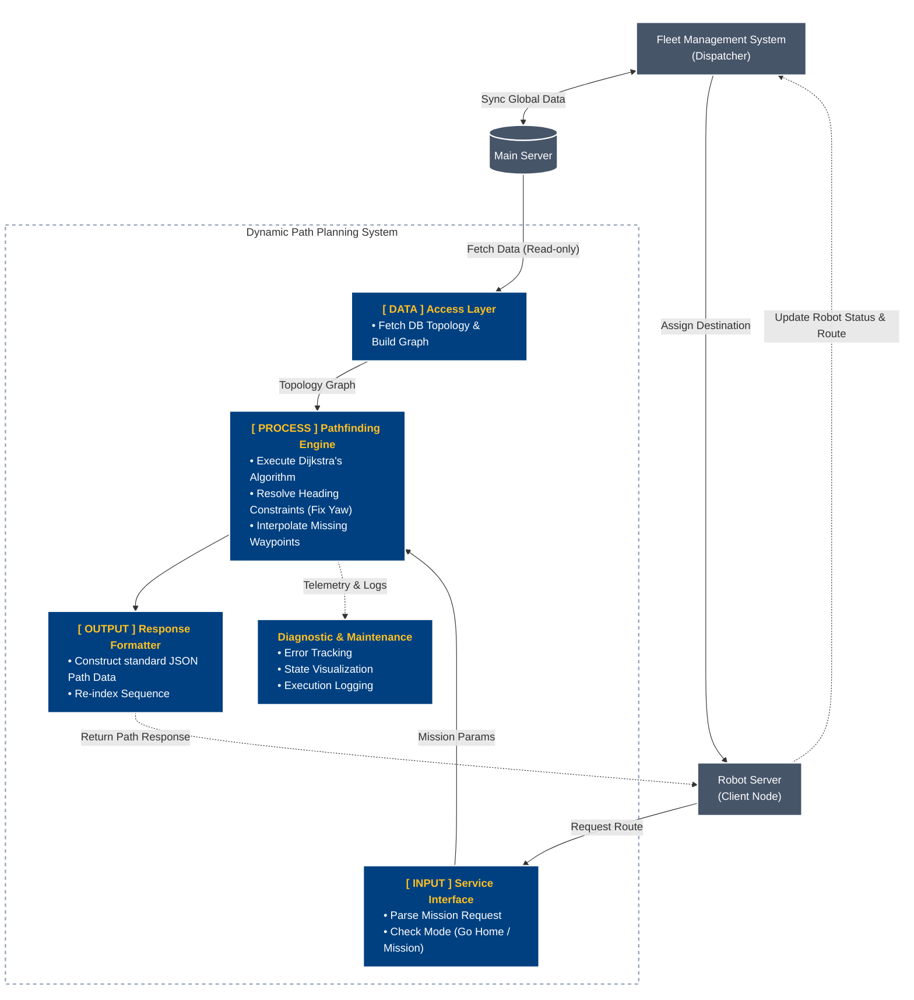
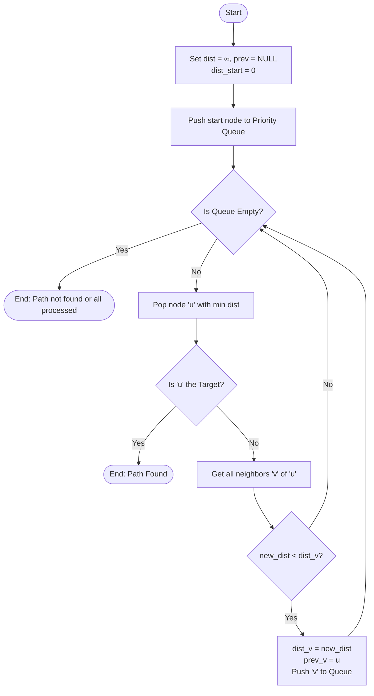

### Dynamic Path Planning System for Robotics Cat

**Software Requirements Specification & Technical Design**

#### 1. Requirements Engineering

**1.1 ที่มาและขอบเขตของปัญหา (Problem Statement & Scope)**
1) ระบบเดิมสั่งการหุ่นยนต์ผ่านชุดไฟล์ภารกิจ JSON Template ที่ระบุลำดับตำแหน่งและค่าคอนฟิกไว้ตายตัวแบบ Static Array (เช่น `final_packing_1month.json`)
2) ระบบเดิมไม่สามารถปรับเปลี่ยนจุดเริ่มต้นหรือสลับลำดับการตรวจจับแบบยืดหยุ่นได้
3) หากผู้ใช้งานเลือกเฉพาะจุดที่ต้องการตรวจสอบ (เช่น จุด 1, 2, 3) ระบบเดิมไม่สามารถหาเส้นทางย่อยและแทรกจุดเชื่อมต่อ (Via Nodes) ระหว่างจุดที่ไม่เชื่อมต่อกันโดยตรงได้โดยอัตโนมัติ
4) การกำหนดทิศทางหัวหุ่นยนต์ (AngleYaw) แบบคงที่ตลอดเวลาทำให้หุ่นยนต์ไม่สามารถหมุนตัวล่วงหน้าตามแนวเส้นทางที่เดินจริงได้อย่างราบรื่น
5) ระบบใหม่ต้องแปลงฐานข้อมูลจุดตรวจทั้งหมดให้อยู่ในรูป Graph Topology และใช้ Dijkstra's Algorithm คำนวณรอยต่อระหว่างจุดเป้าหมาย พร้อมสร้าง JSON Template ส่งกลับให้ตัวควบคุมหุ่นยนต์ทำงานได้อย่างถูกต้อง

**1.2 ข้อกำหนดเชิงฟังก์ชัน (Functional Requirements - FR)**

**1.2.1 Graph Topology Transformation (การแปลงแม่แบบทางเดินเป็นโครงข่ายกราฟ)**
- ระบบต้องสามารถอ่านข้อมูลพิกัด (X, Y, Z) และการเชื่อมต่อ (Edges) จากฐานข้อมูลพิกัดโหนด (Node Database) และฐานข้อมูลเส้นทาง (Edge Topology)
- ระบบจะต้องสร้างโครงสร้างข้อมูลแบบ Directed/Undirected Graph ไว้ในหน่วยความจำ (In-memory Graph) เพื่อรองรับการค้นหา
- หากไม่มีข้อมูลการเชื่อมต่อ ระบบจะต้องสามารถเชื่อมต่อจุดที่อยู่ใกล้เคียงกันแบบลำดับ (Sequential Mesh) จากไฟล์ JSON เพื่อสร้างกราฟจำลองขึ้นมาทดแทนได้อัตโนมัติ

**1.2.2 Multi-Segment Waypoint Interpolation & Stitching (การคำนวณแทรกเส้นทางระหว่างจุดภารกิจ)**
- ระบบต้องรองรับการรับข้อมูล Input เป็น Template เส้นทางที่ประกอบไปด้วยจุดเป้าหมายหลัก (Inspection และ Via nodes) เช่น เส้นทาง `[A, B, C]`
- ระบบต้องใช้ Dijkstra's Algorithm (หรือเทียบเท่า) เพื่อประมวลผลหาจุดเชื่อมต่อ (Intermediate Via Nodes) ที่หายไประหว่างเป้าหมายหลัก
- ตัวอย่าง: หากหุ่นยนต์ต้องการเดินทางจากจุด `A` ไปยัง `B` แต่ไม่มีเส้นทางตรงเชื่อมกัน ระบบจะค้นหาและแทรกจุดเชื่อมต่อที่จำเป็น เช่น `A -> A01 -> A02 -> B` ให้โดยอัตโนมัติ เพื่อให้หุ่นยนต์สามารถทำงานตาม Template ได้อย่างไร้รอยต่อ

**1.2.3 Dynamic Heading Constraint Management**
- ระบบจะต้องสามารถบริหารจัดการมุมหันหน้าของหุ่นยนต์ (AngleYaw หรือ Heading) ตามพารามิเตอร์ควบคุมทิศทาง (Heading Constraint Parameter) ที่ตั้งค่าไว้ที่แต่ละโหนดได้อย่างยืดหยุ่น โดยแบ่งระดับความสำคัญเป็น 3 ระดับ:
  - **Level 0 (Fully Locked):** ล็อคทิศทางแบบตายตัว หุ่นยนต์ต้องหันหน้าตามค่าเดิมที่ถูกตั้งไว้ในระบบเสมอ (ไม่ว่าจะเป็นภารกิจใดก็ตาม)
  - **Level 1 (Conditionally Locked):** ทิศทางจะถูกล็อคตามค่าเดิมเมื่อเป็นการทำงานปกติ (เช่น จุดตรวจสอบ) แต่ถ้าระบบอยู่ในโหมด "กลับฐาน (Return to Base / Go Home)" การล็อคนี้จะถูกยกเลิกเพื่อให้หุ่นยนต์เดินหน้าผ่านไปได้อย่างรวดเร็ว
  - **Level 2 (Freely Editable):** จุดเชื่อมต่อที่ไม่มีความสำคัญด้านทิศทาง ระบบจะคำนวณมุม AngleYaw ใหม่โดยอัตโนมัติ ให้หุ่นยนต์หันหน้าไปทางจุดหมายถัดไปเสมอ เพื่อการเคลื่อนที่ราบรื่นที่สุด

**1.2.4 Locomotion & Mode Integrity Preservation (การคงสภาพพารามิเตอร์การขับเคลื่อน)**
- เมื่อมีการแทรกจุดใหม่ หรือจัดลำดับเส้นทางใหม่ ระบบจะต้องรักษาสภาพของพารามิเตอร์ที่ควบคุมพฤติกรรม (Locomotion) ของแต่ละโหนดไว้อย่างถูกต้อง เช่น รูปแบบการก้าวเดิน (Gait), ความเร็ว (Speed), โหมดนำทาง (Navigation Mode), ท่าทาง (Posture) และโหมดหลบหลีกสิ่งกีดขวาง (Obstacle Avoidance Mode)
- การคัดลอกหรือสร้างโหนดใหม่จะต้องดึงค่ามาตรฐานจากฐานข้อมูลหลักมาใส่ลงใน Template อย่างแม่นยำ

**1.2.5 JSON Schema Compatibility & Sequence Re-indexing (การส่งออกและจัดลำดับดัชนีใหม่)**
- โครงสร้างข้อมูลที่คำนวณเสร็จสิ้นแล้ว จะต้องถูกแปลงกลับให้อยู่ในรูปแบบโครงสร้าง JSON Schema เดิมของหุ่นยนต์
- ระบบจะต้องทำการ Re-index หมายเลขลำดับของจุดอ้างอิงและ Task ย่อยทั้งหมดใหม่ เพื่อไม่ให้เกิดข้อขัดแย้ง (Conflict)
- รองรับการ Export ไฟล์ผลลัพธ์ให้อยู่ในโครงสร้างมาตรฐาน เพื่อให้พร้อมสำหรับการ Deploy ไปยังระบบควบคุมหุ่นยนต์ทันที

**1.3 ข้อกำหนดที่ไม่ใช่เชิงฟังก์ชัน (Non-Functional Requirements - NFR)**

**1.3.1 Reliability & Safety - Graph Disconnection Handling**
- หากจุดเริ่มต้นและเป้าหมายอยู่บนพื้นที่ที่ไม่สามารถเชื่อมต่อถึงกันได้ (Graph Disconnected) ระบบจะต้องไม่เกิดการทำงานขัดข้อง (Crash) แต่ต้องแสดงผลแจ้งเตือน Error ให้ผู้ใช้ทราบอย่างชัดเจน
- ระบบต้องมีกลไกป้องกันการวนลูปไม่รู้จบ (Infinite Loop Prevention) ในกรณีที่ข้อมูลความสัมพันธ์ของโหนด (Edge Topology) เกิดความผิดปกติหรือมีการอ้างอิงกลับไปมาแบบวงกลม (Circular Reference)

**1.3.2 Computational Latency & Performance**
- การคำนวณค้นหาเส้นทางแบบกราฟจะต้องทำงานเสร็จสิ้นด้วยความรวดเร็ว (ต่ำกว่า 500 ms) เพื่อไม่ให้กระทบต่อประสบการณ์ใช้งาน (User Experience) ของส่วนแสดงผล (UI Layer)
- โครงสร้างอัลกอริทึมต้องได้รับการปรับแต่งให้ใช้หน่วยความจำ (Memory Footprint) อย่างมีประสิทธิภาพ รองรับการประมวลผลกราฟที่มีความซับซ้อนและมีจำนวนโหนดมากกว่า 1,000 จุดได้อย่างราบรื่น

**1.3.3 Data Precision & Zero Data Corruption**
- การคำนวณและแปลงพิกัด (X, Y, Z) ตลอดจนองศาการหมุน (Radian) จะต้องใช้ทศนิยมความละเอียดสูง ป้องกันความคลาดเคลื่อนสะสม (Floating-point Error) ระหว่างกระบวนการคำนวณ
- การส่งออกข้อมูลผลลัพธ์จะต้องคงโครงสร้างและชนิดของข้อมูล (Data Type) เดิมไว้อย่างครบถ้วน ห้ามมีการสูญหายหรือการปัดเศษค่าตัวเลขที่อาจส่งผลต่อความแม่นยำในการเดินของหุ่นยนต์

**1.3.4 Fail-Safe & Slope Constraint Validation**
- ระบบต้องมีความสามารถที่จะป้องกันการสร้างเส้นทางที่ฝืนข้อจำกัดทางฟิสิกส์ของหุ่นยนต์ (เช่น เส้นทางที่ไม่ได้อยู่ในโครงข่าย) โดยยึดถือข้อมูลที่ถูกรับรองแล้วในฐานข้อมูลเป็นหลัก
- ในกรณีที่ระบบตรวจพบเส้นทางที่มีความเสี่ยงสูง (เช่น การเชื่อมต่อที่ถูกระบุว่าอันตราย) ระบบจะต้องระงับการสร้างเส้นทางนั้นและส่งคืนค่าความผิดพลาด (Failure Code) ทันทีเพื่อความปลอดภัย

**1.3.5 Modularity & Extensibility (ความยืดหยุ่นและรองรับการขยายตัว)**
- **Decoupled Architecture:** โครงสร้างของระบบประมวลผลเส้นทาง (Path Planning Engine) ต้องถูกออกแบบให้เป็นอิสระจากส่วนแสดงผล (GUI Layer) อย่างสิ้นเชิง เพื่อรองรับการทำงานแบบ Headless Mode หรือนำไปเชื่อมต่อกับระบบอื่นผ่าน API ในอนาคต
- **Algorithm Interchangeability:** โครงสร้างของระบบ (Interface) ต้องรองรับการสับเปลี่ยนอัลกอริทึมค้นหาเส้นทาง (เช่น จาก Dijkstra เป็น A* หรือ D*) ได้โดยไม่ต้องปรับแก้ Logic หลักในส่วนการทำงานอื่นๆ ของโปรแกรม

---

#### 2. System Architecture & Technical Design

**2.1 สถาปัตยกรรมเชิงตรรกะและองค์ประกอบของระบบ (Logical Architecture & Components)**



การออกแบบสถาปัตยกรรมซอฟต์แวร์ถูกออกแบบโดยแยกระบบออกเป็น 3 เลเยอร์อิสระ (Separation of Concerns) เพื่อให้ระบบสามารถทดสอบ (Testable) และดูแลรักษาได้ง่าย (Maintainable):

1. **Data Access & State Management Layer:** 
   - ทำหน้าที่เป็นชั้นเชื่อมต่อและจัดการฐานข้อมูล (Data Persistence & I/O Operations)
   - **การจัดการ `nodes.csv` (Vertex Data):** ทำหน้าที่เป็นฐานข้อมูลหลักของจุดพิกัดทั้งหมดบนแผนที่ เลเยอร์นี้จะโหลดข้อมูลพิกัด (X, Y, Z), องศาหุ่นยนต์ (Yaw), และพารามิเตอร์ควบคุมอื่นๆ ของแต่ละโหนด นำมาสกัดและสร้างเป็นจุดยอด (Vertices) ของกราฟเก็บไว้ในหน่วยความจำ (In-memory)
   - **การจัดการ `paths.csv` (Edge Topology):** ทำหน้าที่กำหนดความสัมพันธ์เชิงพื้นที่ เลเยอร์นี้จะอ่านข้อมูลเพื่อกางแผนผังว่าโหนดใดสามารถเดินเชื่อมถึงกันได้บ้าง (Source ไปยัง Target) และนำมาผูกเส้นเชื่อม (Edges) ให้กับโหนดต่างๆ เป็นแบบ Directed Graph (กราฟระบุทิศทาง) เพื่อป้องกันไม่ให้อัลกอริทึมคำนวณเส้นทางเดินย้อนศรในจุดบังคับ

2. **Pathfinding Engine ([PROCESS] Layer):**
   - เป็นหัวใจหลักของระบบ (Business Logic Core) ที่ทำหน้าที่ประมวลผลโครงสร้างกราฟทั้งหมด ได้รับการออกแบบให้แยกตัวเป็นอิสระจากส่วนแสดงผล (Decoupled from GUI) โดยอาศัยหลักการทางคณิตศาสตร์และอัลกอริทึมในการประมวลผล ดังนี้:
   - **Graph Topology Construction:** นำข้อมูลจุดพิกัดและความสัมพันธ์เชิงพื้นที่มาประกอบกันเป็นโครงข่าย (Adjacency List)
   - **Shortest Path Computation:** อัลกอริทึมหลักสำหรับรับค่าจุดเริ่มต้น (Start) และจุดเป้าหมาย (Target) เพื่อค้นหาและเชื่อมต่อเส้นทางย่อยที่มีระยะทางรวมสั้นที่สุด
   - **Kinematic Yaw Resolution:** อัลกอริทึมสำหรับประมวลผลทิศทางการหันหน้า (Heading/Yaw) ล่วงหน้าของหุ่นยนต์ในแต่ละพิกัด เพื่อให้การเคลื่อนที่เป็นไปอย่างราบรื่นและตรงตามข้อกำหนดของภารกิจ
   
   **Process Diagram ของการทำงาน (Algorithm Execution Flow):**
   ```mermaid
   flowchart TD
       A([Start: Request Path]) --> B{Validate Nodes}
       B -->|Start/Target Missing| Error([Return Null / Error])
       B -->|Nodes Valid| C[Initialize Priority Queue & Distances]
       
       C --> D{Queue is Empty?}
       D -->|Yes| E([No Path Found])
       D -->|No| F[Pop Node with Min Cost]
       
       F --> G{Is Target Node?}
       G -->|Yes| H[Backtrack to Build Raw Path]
       G -->|No| I[Iterate Neighbors]
       
       I --> J[Relax Edges & Update Cost]
       J --> D
       
       H --> K[Apply Heading Constraints\nFY = 0, 1, 2]
       K --> L[Format Output to JSON Sequence]
       L --> M([End: Return Route])
   ```

   **คำอธิบายขั้นตอนการทำงาน (Process Description):**
   1. **[A] Start & [B] Validate Nodes:** ระบบรับคำสั่งให้หาเส้นทาง โดยตรวจสอบก่อนว่าโหนดต้นทาง (Start) และโหนดปลายทาง (Target) มีอยู่จริงในกราฟหรือไม่ หากไม่มี จะหยุดทำงานและคืนค่า Error (Fail-safe)
   2. **[C] Initialize Priority Queue:** กำหนดระยะทางของโหนดเริ่มต้นเป็น 0 และโหนดอื่นๆ เป็นอนันต์ ($\infty$) พร้อมดึงโหนดเริ่มต้นใส่ลงในคิวแบบจัดลำดับความสำคัญ (Min-Heap)
   3. **[D] & [F] Queue Evaluation:** ลูปดึงโหนดที่มีค่า Cost (ระยะทางสะสม) ต่ำที่สุดออกมาประมวลผลก่อนเสมอ เพื่อรับประกันว่าจะเจอเส้นทางที่สั้นที่สุด หากคิวว่างเปล่าก่อนเจอจุดหมาย แสดงว่าทางขาด (Disconnected) และจะคืนค่า No Path Found
   4. **[G] Target Check & [I-J] Relax Edges:** หากโหนดที่ดึงมาไม่ใช่จุดหมาย ระบบจะกางเพื่อนบ้านที่เชื่อมติดกันออก (Iterate Neighbors) และคำนวณระยะทางใหม่ หากระยะใหม่สั้นกว่าเดิม จะอัปเดตค่าและจับโยนกลับเข้าคิว
   5. **[H] Backtrack Path:** เมื่อดึงโหนดเป้าหมายออกมาจากคิวได้สำเร็จ (Early Exit) ระบบจะไล่ย้อนกลับ (Backtrack) ตามรอยโหนดก่อนหน้า (Previous Nodes) เพื่อสร้างเส้นทางดิบที่ถูกต้อง
   6. **[K] Apply Heading Constraints:** นำเส้นทางที่ได้มาวนลูปคำนวณองศาการหันหน้า (Kinematic Yaw) ล่วงหน้า โดยอ้างอิงกับกฎ FY (0, 1, 2) เช่น การหันหน้าเข้าหาจุดหมายถัดไปเพื่อความลื่นไหล
   7. **[L-M] Format Output:** แปลงข้อมูลเส้นทางและค่าพารามิเตอร์ทั้งหมดให้อยู่ในโครงสร้าง JSON ดั้งเดิม พร้อม Re-index ลำดับใหม่ เพื่อส่งมอบให้ระบบนำทางของหุ่นยนต์ต่อไป

3. **Service Communication Interface (API/Service Node):**
   - ในท้ายที่สุด (Ultimate Goal) โมดูลนี้จะทำหน้าที่เป็น Service Server ภายในระบบเครือข่ายของหุ่นยนต์ (เช่น ROS Node)
   - รอรับคำสั่ง (Call Service) จาก Client ที่ต้องการเส้นทาง และส่งพารามิเตอร์เป้าหมายไปให้ Core Engine ประมวลผล
   - ส่งคืนผลลัพธ์เส้นทาง (Return Path) กลับไปยัง Client ในรูปแบบมาตรฐาน (ส่วน GUI หรือ Visualization Canvas ที่มีอยู่ในปัจจุบันเป็นเพียงเครื่องมือเสริมสำหรับการจำลองและทดสอบการทำงานของอัลกอริทึมในฝั่งผู้พัฒนาเท่านั้น)

**2.2 แบบจำลองทางคณิตศาสตร์และอัลกอริทึม (Mathematical Models & Algorithms)**

**2.2.1 Topological Graph & Edge Cost (Weight Formulation)**
ก่อนการค้นหาเส้นทาง ระบบจะสร้างโครงข่าย $G = (V, E)$ โดยที่ $V$ คือเซ็ตของโหนดทั้งหมด และ $E$ คือเส้นทางเชื่อมต่อ
- การคำนวณน้ำหนัก (Cost) หรือระยะทางระหว่างโหนด $A(x_1, y_1, z_1)$ และโหนด $B(x_2, y_2, z_2)$ จะใช้สมการ Euclidean Distance 3 มิติ เพื่อสะท้อนระยะทางเชิงกายภาพที่แท้จริง:
  $$W_{A,B} = \sqrt{(X_B - X_A)^2 + (Y_B - Y_A)^2 + (Z_B - Z_A)^2}$$

**2.2.2 Dijkstra's Algorithm (อัลกอริทึมค้นหาเส้นทางที่สั้นที่สุด)**
อัลกอริทึม Dijkstra คือกลไกหลักที่ระบบใช้ในการค้นหาเส้นทาง โดยมีหลักการทำงานที่เน้นความแม่นยำและการหา "ต้นทุน (Cost) หรือระยะทางที่ต่ำที่สุด" ดังนี้:

- **แนวคิดหลัก (Core Concept):** คล้ายกับการสาดน้ำลงบนแผนที่ น้ำจะไหลแผ่ออกไปทุกทิศทางพร้อมๆ กัน ถ้าน้ำไหลไปถึงจุดเป้าหมายผ่านเส้นทางไหนได้ก่อน (ระยะทางสั้นที่สุด) ระบบจะจำเส้นทางนั้นไว้เป็นคำตอบ
- **การจัดลำดับด้วย Priority Queue:** เพื่อไม่ให้ระบบต้องประมวลผลทุกโหนดแบบสูญเปล่า เราใช้ `Priority Queue` (คิวจัดลำดับความสำคัญ) เข้ามาช่วย โดยระบบจะเลือก "โหนดที่อยู่ใกล้ที่สุด ณ ตอนนั้น" ขึ้นมาพิจารณาก่อนเสมอ ทำให้ได้ความเร็วระดับ $O((|V| + |E|) \log |V|)$

- **Standard Dijkstra's Flowchart (แผนภาพหลักการทำงานพื้นฐาน):**


- **กระบวนการประมวลผล (Pseudo-algorithm):** 
```text
function find_shortest_path(Graph, start_node, end_node):
    if start_node not in Graph or end_node not in Graph:
        return ERROR "Node not found"

    // 1. Initialization
    distances = array of INFINITY
    previous_nodes = array of NULL
    distances[start_node] = 0
    PriorityQueue.push((0, start_node))

    // 2. Node Relaxation (Loop)
    while PriorityQueue is not empty:
        current_dist, u = PriorityQueue.pop_min()

        if u == end_node:
            break  // Early Exit (Termination)

        for each neighbor v of u in Graph:
            new_dist = current_dist + weight(u, v)
            if new_dist < distances[v]:
                distances[v] = new_dist
                previous_nodes[v] = u
                PriorityQueue.push((new_dist, v))

    // 3. Backtracking
    if distances[end_node] == INFINITY:
        return "No Path Found"
        
    path = empty list
    current = end_node
    while current is not NULL:
        path.append(current)
        current = previous_nodes[current]
        
    return path.reverse()
```

**2.2.3 Kinematic Heading Resolution (การคำนวณองศาหมุนตัวของหุ่นยนต์)**
เมื่อได้ลำดับพิกัดเส้นทางมาแล้ว ระบบจะต้องคำนวณว่าหุ่นยนต์ควรจะ **"หันหน้าไปทางไหน"** ในแต่ละจุด (Heading/Yaw)
ตามปกติ ระบบจะคำนวณมุมองศาใหม่ล่วงหน้า ($\theta$) โดยให้หุ่นยนต์หันหน้าชี้ไปยังจุดเป้าหมายถัดไปเสมอ 
$$\theta = \text{atan2}(Y_{next} - Y_{current}, X_{next} - X_{current})$$
อย่างไรก็ตาม การหมุนตัวจะถูกควบคุมด้วย **กฎของโหนด (Heading Policy หรือตัวแปร $FY$)** ซึ่งแบ่งออกเป็น 3 ระดับ เพื่อให้หุ่นยนต์มีพฤติกรรมที่สมจริงในแต่ละสถานการณ์:

- **$FY = 0$ (ล็อคทิศทางแบบตายตัว / Fully Locked):** 
  - หุ่นยนต์จะถูกบังคับให้หันหน้าตามค่าพิกัดดั้งเดิมที่เซ็ตไว้ในฐานข้อมูลเสมอ ไม่ว่าจะเดินมาจากมุมไหน
  - **เหมาะสำหรับ:** "จุดเข้าจอดชาร์จแบตเตอรี่" (ChargeIn) หรือจุดที่มีพื้นที่แคบมากๆ ที่บังคับให้หุ่นยนต์ต้องหันหน้าหรือถอยหลังเข้าทำมุมเฉพาะเท่านั้น

- **$FY = 1$ (ล็อคตามเงื่อนไขภารกิจ / Conditionally Locked):** 
  - ในสถานการณ์ปกติ (เดินทำภารกิจ) หุ่นยนต์จะถูกล็อคให้หันหน้าตามฐานข้อมูล เพื่อให้กล้องหันไปโฟกัส "จุดที่ต้องการตรวจสอบ" (Inspection) ได้แม่นยำ
  - แต่ถ้าระบบอยู่ในโหมด "กลับฐานฉุกเฉิน (Go Home)" การล็อคนี้จะถูกปลดออกทันที หุ่นยนต์จะเลือกหันหน้าเดินพุ่งไปข้างหน้า ($\theta$) แทน เพื่อให้ทำเวลาหนีกลับฐานได้เร็วที่สุดโดยไม่ต้องมัวแต่หันกล้องไปมองจุดตรวจ

- **$FY = 2$ (หมุนตัวอิสระ / Freely Editable):** 
  - ระบบจะคำนวณให้หุ่นยนต์หมุนตัวหันหน้าเข้าหาจุดหมายถัดไป ($\theta$) เสมอ
  - **เหมาะสำหรับ:** "ทางผ่านเชื่อมต่อ (Via Nodes)" หรือทางเดินกว้างๆ ทั่วไป การใช้ FY=2 จะช่วยให้หุ่นยนต์เดินเข้าโค้งได้ราบรื่นเป็นธรรมชาติ (หันหน้ามองทางเสมอ) แทนที่จะเดินแบบสไลด์ข้าง (Crab Walk) ไปตามจุดต่างๆ

---

#### 3. Task Breakdown

เพื่อให้ทีมพัฒนามองเห็นภาพรวมและลำดับความสำคัญของงาน (Implementation Plan):

| Phase | Task Name | Status | Description |
| :---: | :--- | :---: | :--- |
| **1** | Graph Construction | ✅ | เขียนระบบอ่านและแมปข้อมูลจาก `nodes.csv` และ `paths.csv` แบบ Directed Graph |
| **1** | Dijkstra Planner | ✅ | พัฒนาคลาสหาเส้นทางด้วย Priority Queue `O(V+E log V)` |
| **1** | Kinematic Constraints | ✅ | ประยุกต์ตรรกะคำนวณองศาหมุนตัวล่วงหน้า (Heading/Yaw) ตามกฎ FY=0, 1, 2 |
| **2** | Error Handling | ✅ | ตั้งค่าการคืนผลลัพธ์ (Return Null) และพิมพ์ Log แจ้งเตือนสาเหตุเมื่อหาเส้นทางไม่พบ |
| **2** | Unit Tests | ✅ | เขียน Automated Test ครอบคลุมเคสกราฟขาด (Disconnected) และชื่อโหนดผิด |
| **3** | Path ID Collision | ✅ | ปรับระบบสร้าง ID เส้นทางใหม่ให้เป็นแบบตรวจสอบ Max ID เสมอเพื่อป้องกัน ID ซ้ำ |
| **3** | Bidirectional Verification | ✅ | ตรวจสอบโครงสร้างใน `paths.csv` ให้เส้นทางสวนเลนมี 2 แถว (A->B, B->A) |
| **3** | Node Cleansing | ✅ | กำจัดข้อมูลโหนดขยะและเส้นทางที่ไม่ได้เชื่อมต่อกับพื้นที่หลัก |
| **4** | ROS Service Node | ⏳ | เปลี่ยนคลาส `dijkstra_planner.py` ให้ทำงานในรูปแบบของ ROS Service Server |
| **4** | Message Types | ⏳ | นิยาม Custom Service `.srv` สำหรับรับ Request พิกัด และส่ง Response เส้นทาง |
| **4** | Real-world Testing | ⏳ | นำไปเชื่อมต่อกับระบบควบคุมของหุ่นยนต์จริงเพื่อทดสอบการเคลื่อนที่ |

*(สัญลักษณ์: ✅ = เสร็จสิ้นแล้ว, ⏳ = รอการดำเนินการ)*

---

#### 4. Implementation

การจัดเก็บข้อมูลแบบไฟล์ (Flat-file Storage) แบ่งออกเป็นส่วนการจัดการโหนด เส้นทาง คลาสประมวลผล และระบบจำลอง ดังนี้:

**4.1 ฐานข้อมูลโหนดพิกัด (`nodes.csv`)**
ไฟล์ฐานข้อมูลหลักที่ใช้เก็บข้อมูลตำแหน่งทางภูมิศาสตร์ (Coordinates) และพารามิเตอร์ควบคุมพฤติกรรมของหุ่นยนต์ในแต่ละจุด 

- **โครงสร้าง:** `id, name, type, "{x, y, z, yaw}", ...`
- **ตัวอย่าง:** `thermal-58,,station,"{9.02,-181.86,-0.03,-2.98}",,0,1st_floor,...`

ระบบจัดเก็บฐานข้อมูลจุดพิกัดในไฟล์ `nodes.csv` โดยมีคอลัมน์ทั้งหมด 16 คอลัมน์ (Index 0 ถึง 15) เรียงลำดับโครงสร้างข้อมูลดังนี้:
1. **Node ID (Index 0):** ไอดีประจำตัวของโหนด (Primary Key) เช่น `Charge`, `via-219-out`, `thermal-77`
2. **Name (Index 1):** ชื่อสำหรับแสดงผล (Display Name) หรือเป็นชื่อเฉพาะ
3. **Type (Index 2):** ประเภทของโหนดเพื่อนำไปกำหนดสิทธิ์การเคลื่อนที่หรือการแสดงผล เช่น `station`, `via`
4. **Pose (Index 3):** ข้อมูลพิกัดและทิศทางหุ่นยนต์ในรูปแบบข้อความหุ้มด้วยวงเล็บปีกกาและเครื่องหมายคำพูดคู่ `"{X, Y, Z, Yaw}"`
5. **Layer (Index 4):** ฟิลด์เดิมที่ใช้เก็บชั้นอาคาร ปัจจุบันปล่อยว่างไว้ตามความต้องการของระบบเพื่อลดความซ้ำซ้อน
6. **Map ID (Index 5):** ไอดีของแผนที่ที่โหนดนี้อยู่ เช่น `0` สำหรับชั้น 1, `1` สำหรับชั้น 2
7. **Floor Name (Index 6):** ชื่อของแผนที่หรือชั้นอาคารเพื่อแสดงใน GUI เช่น `1st_floor`, `2nd_floor`
8. **Fix Yaw (Index 7):** พารามิเตอร์ระบุกฎการล็อกทิศทางหันหน้าของหุ่นยนต์ (`0` = Fully Locked, `1` = Conditionally Locked, `2` = Freely Editable)
9. **Gait (Index 8):** รหัสรูปแบบการเดินของหุ่นยนต์ Jueying (เช่น `0` = Trot, `2` = Crawl)
10. **NavMode (Index 9):** รหัสโหมดการนำทางที่ใช้ในการเคลื่อนที่เข้าหาโหนดนี้
11. **Speed (Index 10):** ความเร็วจำกัดสำหรับช่วงเคลื่อนที่นี้
12. **Terrain (Index 11):** ลักษณะประเภทของพื้นผิวทางเดิน
13. **Point Info (Index 12):** การระบุประเภทโหนดเพื่อเลือกว่าต้องหยุดตรวจสอบภารกิจหรือไม่ (`0` = Via Node/ทางผ่านปกติ, `1` = Inspection Node/จุดตรวจสอบภารกิจ)
14. **ObsMode (Index 13):** โหมดควบคุมการหลบหลีกสิ่งกีดขวางของหุ่นยนต์
15. **Manner (Index 14):** พฤติกรรมเฉพาะในการเคลื่อนไหว
16. **Posture (Index 15):** ท่าทางความสูงต่ำของตัวหุ่นยนต์ (เช่น ความสูงของตัวเครื่องขณะตรวจสอบ)

**รูปแบบและประเภทของจุดพิกัด (Node Types & Naming Conventions):**
ในระบบจะมีการแบ่งประเภทของจุดอ้างอิงผ่านรูปแบบของชื่อ (ID Prefix) เพื่อให้ง่ายต่อการกำหนดพฤติกรรมการเคลื่อนที่:

**4.1.1 Inspection Nodes (จุดตรวจสอบภารกิจ)**
เป็นจุดที่หุ่นยนต์ต้องหยุดเดินเพื่อสแกนหรือเก็บข้อมูล กฎของโหนดมักถูกตั้งค่า `FY=1` (Conditionally Locked) เพื่อบังคับให้กล้องหันไปโฟกัสเป้าหมายอย่างแม่นยำ แบ่งออกตามประเภทภารกิจย่อยดังนี้:

* **4.1.1.1 Asset Inspection (การตรวจสอบความครบถ้วนของวัตถุ):**
  - **รูปแบบชื่อ:** นำหน้าด้วย `asset-*` (เช่น `asset-01`) หรือใช้อ้างอิงสำหรับการตรวจสอบกุญแจความปลอดภัย `loto-*`
  - **คีย์สำคัญในไฟล์ JSON (Key Parameters):**
    - `Inspection` (string): ระบุประเภทภารกิจมีค่าเป็น `"asset_inspection"`
    - `CamPTZ` (array of 3 floats): มุมและระยะซูมกล้อง `[Pan, Tilt, Zoom]` (เช่น `[180.0, 0.0, 1.0]`)
    - `Roi` (array): พิกัดและขอบเขตพื้นที่สแกนวัตถุแบบปกติ `[[[x1, y1], [x2, y2]]]`
  - **รายละเอียดภารกิจ:** กระบวนการตรวจสอบการมีอยู่ของวัตถุเป้าหมายผ่านภาพถ่าย RGB โดยใช้หลักการตรวจจับสติ๊กเกอร์สีเด่นที่ติดไว้ ณ จุดเก็บวัตถุ ในกรณีที่วัตถุไม่อยู่ในตำแหน่งที่กำหนด ระบบจะมองเห็นสติ๊กเกอร์ และใช้ระบบสี HSV ในการตรวจจับ หากตรวจพบสติ๊กเกอร์ในบริเวณที่สนใจ ระบบจะถือว่าอุปกรณ์ไม่ครบถ้วน และทำการส่งสัญญาณแจ้งเตือนไปยัง Server ทันที

* **4.1.1.2 Thermal Inspection (การตรวจสอบความร้อน):**
  - **รูปแบบชื่อ:** นำหน้าด้วย `thermal-*` (เช่น `thermal-101`, `thermal-58`)
  - **คีย์สำคัญในไฟล์ JSON (Key Parameters):**
    - `Inspection` (string): ระบุประเภทภารกิจมีค่าเป็น `"thermal_inspection"`
    - `CamPTZ` (array of 3 floats): ทิศทางการหันหน้ากล้องความร้อน `[Pan, Tilt, Zoom]` (เช่น `[171.0, 0.0, 1.0]`)
    - `Roi` (array): พิกัดพื้นที่ตรวจสอบความร้อนของเครื่องจักร `[[[x1, y1], [x2, y2]]]`
    - `Threshold` (float): อุณหภูมิเกณฑ์สูงสุดที่จะแจ้งเตือนความผิดปกติ (องศาเซลเซียส)
  - **รายละเอียดภารกิจ:** กระบวนการตรวจสอบความร้อนโดยการบันทึกภาพถ่ายความร้อนในบริเวณที่สนใจ ระบบจะดำเนินการตัดกรอบภาพ (Cropping) เพื่อคัดเฉพาะส่วนของเครื่องจักรหรือวัตถุเป้าหมายมาวิเคราะห์ จากนั้นจะทำการตรวจสอบค่าอุณหภูมิในทุกพิกเซลของภาพ หากพบพิกเซลใดที่มีอุณหภูมิสูงเกินกว่าเกณฑ์ที่กำหนด จะถือว่าการตรวจสอบไม่ผ่านและระบบจะส่งคำแจ้งเตือนไปยัง Server เพื่อเฝ้าระวังอันตราย

* **4.1.1.3 Analog Gauge Inspection (การตรวจสอบมาตรวัดอนาล็อก):**
  - **รูปแบบชื่อ:** นำหน้าด้วย `gauge-*` (เช่น `gauge-1x`)
  - **คีย์สำคัญในไฟล์ JSON (Key Parameters):**
    - `Inspection` (string): ระบุประเภทภารกิจมีค่าเป็น `"gauge_inspection"`
    - `CamPTZ` (array of 3 floats): ทิศทางและระยะซูมกล้อง RGB ส่องหน้าปัดเกจ `[Pan, Tilt, Zoom]` (เช่น `[203.0, 6.0, 2.0]`)
    - `Roi` (array): กรอบพื้นที่ครอบล้อมมาตรวัดเพื่อสกัดมุมเข็มชี้ `[[[x1, y1], [x2, y2]]]`
  - **รายละเอียดภารกิจ:** กระบวนการอ่านค่าสถานะจากมาตรวัดอนาล็อกโดยใช้การประมวลผลภาพ RGB ซึ่งตัวเกจจะต้องมีการติดตั้งแถบสีบริเวณขอบเพื่อใช้เป็นเกณฑ์ระบุสถานะ ระบบจะใช้เทคนิค Image Processing ในการตรวจหาตำแหน่งของเกจ และทิศทางของเข็ม จากนั้นจึงใช้ระบบสี HSV ในการจำแนกแถบสีที่เข็มชี้ไปเพื่อระบุสถานะปัจจุบัน

* **4.1.1.4 Vibration Inspection (การตรวจสอบความสั่นสะเทือน):**
  - **รูปแบบชื่อ:** นำหน้าด้วย `vibration-*` (เช่น `vibration-43`)
  - **คีย์สำคัญในไฟล์ JSON (Key Parameters):**
    - `Inspection` (string): ระบุประเภทภารกิจมีค่าเป็น `"vibration_inspection"`
    - `CamPTZ` (array of 3 floats): ทิศทางกล้องในการหันโฟกัส `[Pan, Tilt, Zoom]` (เช่น `[185.0, 15.0, 2.0]`)
    - `Frequency_range` (array of 2 ints): ย่านความถี่คลื่นเสียงที่จะตรวจวิเคราะห์สัญญาณ `[MinFreq, MaxFreq]` (เช่น `[20, 40]`)
    - `Energy_threshold` (float): เกณฑ์ระดับพลังงานเสียงสูงสุดที่กำหนด
    - `Kurtosis_threshold` (float): เกณฑ์สถิติความโด่งคลื่นระบุการผิดจังหวะมอเตอร์
    - `Peak_threshold` (float): ระดับเกณฑ์ยอดเสียงแหลมสะสมสูงสุด
  - **รายละเอียดภารกิจ:** กระบวนการตรวจจับสัญญาณเสียงที่เกิดขึ้นภายในเครื่องจักรเป้าหมาย โดยอาศัยหลักการที่ว่าหากเครื่องจักรมีการเคลื่อนไหวที่ผิดปกติจะก่อให้เกิดเสียงที่แตกต่างไปจากสภาวะปกติ ระบบจะทำการจำแนก และวิเคราะห์ความผิดปกตินั้นผ่านค่าความถี่ (Frequency) และค่าแอมพลิจูด (Amplitude) ของเสียงที่ตรวจวัดได้

* **4.1.1.5 Leakage Inspection (การตรวจหาจุดรั่วไหล):**
  - **รูปแบบชื่อ:** นำหน้าด้วย `leak-*` หรือ `leaked-*`
  - **คีย์สำคัญในไฟล์ JSON (Key Parameters):**
    - `Inspection` (string): ระบุประเภทภารกิจมีค่าเป็น `"leakage_inspection"`
    - `CamPTZ` (array of 3 floats): ทิศทางกล้องนำส่งภาพถ่าย `[Pan, Tilt, Zoom]` (เช่น `[185.0, 15.0, 2.0]`)
    - `Frequency_range` (array of 2 ints): ย่านความถี่ของเสียงสะท้อนอากาศ/ก๊าซรั่วซึม `[MinFreq, MaxFreq]` (เช่น `[20, 40]`)
    - `Energy_threshold` (float): เกณฑ์ระดับพลังงานตรวจจับการรั่วไหลสะสม
  - **รายละเอียดภารกิจ:** กระบวนการตรวจหาจุดรั่วไหลในบริเวณที่สนใจ โดยอาศัยการตรวจจับความถี่ของเสียงที่เกิดจากการเคลื่อนที่ของอากาศ หรือ ก๊าซ ทั้งนี้ เพื่อตรวจสอบและระบุตำแหน่งที่มีการรั่วไหลได้อย่างแม่นยำ

---

**4.2 ฐานข้อมูลโครงสร้างเส้นทาง (`paths.csv`)**

ไฟล์ฐานข้อมูลหลักที่ใช้กำหนดโครงสร้างเครือข่ายของแผนที่ (Graph Topology) โดยระบุการเชื่อมต่อระหว่างคู่โหนด พร้อมพารามิเตอร์การควบคุมการเคลื่อนที่ คอลัมน์ข้อมูลในไฟล์ `paths.csv` มีโครงสร้าง 10 คอลัมน์ดังนี้:

1. `Path_ID` (string/int): รหัสประจำแนวเส้นทางเชื่อมต่อ (Edge ID) เช่น `761`, `path_1`
2. `Source` (string): ไอดีของโหนดต้นทาง (Start Node ID) เช่น `Charge`, `via-219-out`
3. `Target` (string): ไอดีของโหนดปลายทาง (End Node ID) เช่น `via-219-out`, `leakage-41`
4. `Type` (string): ประเภทการเดิน เช่น `nav` (ปกติ), `patrol` (ตรวจการณ์)
5. `Layer` (string/empty): ชั้นการเคลื่อนที่ (ปล่อยว่างหากใช้เลเยอร์ปกติ)
6. `Name` (string): ชื่อแนวทางเชื่อมต่อ อ้างอิงรูปแบบ `Source|Target`
7. `StartPoint` (string): โหนดอ้างอิงจุดเริ่มต้นของการเคลื่อนที่
8. `Direction` (string): ทิศทางการควบคุม เช่น `f` (Forward / เดินหน้าปกติ), `b` (Backward / ถอยหลัง)
9. `Coordinates` (string): อาเรย์พิกัด 2D ที่ใช้เชื่อมต่อระหว่างคู่โหนด เช่น `"[[0, 0], [1, 0]]"`
10. `Map_ID` (int/string): ไอดีของพื้นที่หรือชั้นแผนที่ เช่น `0`

---

**4.3 การจัดระเบียบข้อมูลโหนดและเส้นทางด้วย `NodeManager`**

ในระบบทดสอบและจำลอง จะใช้คลาส `NodeManager` (อ้างอิงไฟล์ `scripts/node_manager.py`) ในการจัดการข้อมูลโครงข่ายของแผนที่ (Graph Topology) ทั้งหมด โดยมีตรรกะการทำงานดังนี้:

- **`load_nodes()` / `load_paths()`:** อ่านไฟล์ CSV แบบแถวต่อแถวเพื่อเก็บโครงสร้างดั้งเดิม หากพบคอลัมน์ขาดหาย คลาสจะกรอกค่าเริ่มต้นให้อัตโนมัติ เพื่อป้องกันปัญหาแถวข้อมูลขาดมาตรฐาน
- **`save_nodes()` / `save_paths()`:** เขียนข้อมูลกลับไปยังไฟล์ CSV โดยใช้การจัดเก็บแบบครอบต่ำที่สุด (`csv.QUOTE_MINIMAL`)
- **`add_node()`:** เมื่อเพิ่มโหนดโดยไม่ระบุ ID ระบบจะใช้ Regular Expression ค้นหาตัวเลขลำดับท้ายสูงสุดบนโหนดที่มีอยู่ และสร้างไอดีใหม่ตามรูปแบบโดยอัตโนมัติ (เช่น `node_[max_num + 1]`)
- **`get_node_type()`:** คัดแยกประเภทระหว่างโหนดทางผ่าน (`via`) และโหนดภารกิจ (`inspection`) โดยสแกนคำค้นหาย่อยใน Node ID หรือ Name

---

**4.4 คลาสประมวลผลเส้นทาง (`DijkstraPlanner`)**

ระบบนำทางมีหัวใจการประมวลผลอยู่ที่คลาส `DijkstraPlanner` (อ้างอิงสคริปต์ `scripts/dijkstra_planner.py`) ซึ่งรวบรวมตรรกะการประมวลผลและการค้นหาผ่านเมธอดต่างๆ ดังนี้:

* **4.4.1 `parse_pose(pose_str)`**
  - **หน้าที่:** แปลงข้อมูลพิกัด (X, Y, Z, Yaw) ที่บันทึกอยู่ในรูปแบบข้อความครอบวงเล็บปีกกา `"{x,y,z,yaw}"` หรือแบบอาเรย์ของข้อมูลดิบในไฟล์ CSV/JSON ให้กลายเป็นข้อมูลประเภท Float/Tuple สำหรับนำไปคำนวณทางทัศนศาสตร์หรือเรขาคณิต
  - **ซอร์สโค้ด:**
    ```python
    def parse_pose(self, pose_str: str) -> Tuple[float, float, float, float]:
        """Parse pose string formatted like '{x,y,z,yaw}' or list/dict."""
        try:
            if isinstance(pose_str, str):
                cleaned = pose_str.strip('{}()[] ')
                parts = [float(p.strip()) for p in cleaned.split(',') if p.strip()]
                x = parts[0] if len(parts) > 0 else 0.0
                y = parts[1] if len(parts) > 1 else 0.0
                z = parts[2] if len(parts) > 2 else 0.0
                yaw = parts[3] if len(parts) > 3 else 0.0
                return x, y, z, yaw
            elif isinstance(pose_str, (list, tuple)):
                x = float(pose_str[0]) if len(pose_str) > 0 else 0.0
                y = float(pose_str[1]) if len(pose_str) > 1 else 0.0
                z = float(pose_str[2]) if len(pose_str) > 2 else 0.0
                yaw = float(pose_str[3]) if len(pose_str) > 3 else 0.0
                return x, y, z, yaw
        except Exception:
            pass
        return 0.0, 0.0, 0.0, 0.0
    ```

* **4.4.2 `add_node(node_id, name, x, y, z, yaw, raw)`**
  - **หน้าที่:** เพิ่มโหนดพิกัดใหม่เข้าสู่โครงสร้าง In-memory Graph พร้อมจัดทำพจนานุกรมดัชนีชื่ออ้างอิง (`name_to_id`) ในรูปแบบตัวพิมพ์เล็กทั้งหมด (Normalized Name Lookup) เพื่อรองรับการสืบค้นชื่อแบบยืดหยุ่นและลดความเสี่ยงจากการพิมพ์ชื่อผิด
  - **ซอร์สโค้ด:**
    ```python
    def add_node(self, node_id: str, name: str = "", x: float = 0.0, y: float = 0.0, z: float = 0.0, yaw: float = 0.0, raw: Any = None):
        """Add a node to the planner graph."""
        nid = str(node_id).strip()
        self.nodes[nid] = {
            'id': nid,
            'name': name or nid,
            'x': float(x),
            'y': float(y),
            'z': float(z),
            'yaw': float(yaw),
            'raw': raw
        }
        if nid not in self.graph:
            self.graph[nid] = []
            
        # Add to name lookup
        norm_name = (name or nid).strip().lower()
        self.name_to_id[norm_name] = nid
        self.name_to_id[nid.lower()] = nid
    ```

* **4.4.3 `add_edge(node1, node2, cost, path_id, bidirectional)`**
  - **หน้าที่:** เชื่อมต่อจุดเข้าด้วยกัน (Edge) เพื่อสร้าง Adjacency List หากเส้นเชื่อมนั้นไม่มีการระบุค่า Cost (ระยะทาง) ระบบจะคำนวณค่าระยะห่างเชิงเส้น 3 มิติ (3D Euclidean Distance) จากตำแหน่งของโหนดทั้งสองและใช้เป็นค่าน้ำหนักโดยอัตโนมัติ
  - **ซอร์สโค้ด:**
    ```python
    def add_edge(self, node1: str, node2: str, cost: Optional[float] = None, path_id: str = "", bidirectional: bool = True):
        """Add an edge between node1 and node2."""
        n1 = str(node1).strip()
        n2 = str(node2).strip()
        if n1 not in self.nodes or n2 not in self.nodes:
            return

        if cost is None:
            # Compute 3D Euclidean distance
            p1 = self.nodes[n1]
            p2 = self.nodes[n2]
            cost = math.sqrt((p1['x'] - p2['x'])**2 + (p1['y'] - p2['y'])**2 + (p1['z'] - p2['z'])**2)

        self.graph[n1].append((n2, cost, path_id))
        if bidirectional:
            self.graph[n2].append((n1, cost, path_id))
    ```

* **4.4.4 `load_from_csv(nodes_csv_path, paths_csv_path)`**
  - **หน้าที่:** สร้างแผนที่นำทางจากการอ่านไฟล์ CSV โดยแปลงข้อมูลความสัมพันธ์เป็น Directed Graph (กราฟมีทิศทาง) และหากไม่มีการระบุไฟล์เส้นทางเชื่อมต่อ (`paths.csv`) ระบบจะเชื่อมโยงจุดพิกัดทั้งหมดตามตำแหน่งใกล้เคียงลำดับก่อนหลัง (mesh graph) ให้โดยอัตโนมัติ
  - **ซอร์สโค้ด:**
    ```python
    def load_from_csv(self, nodes_csv_path: str, paths_csv_path: Optional[str] = None):
        """Load graph topology from nodes.csv and optional paths.csv."""
        if not os.path.exists(nodes_csv_path):
            print(f"[Error] Nodes CSV file not found: {nodes_csv_path}")
            return False

        print(f"[DijkstraPlanner] Loading nodes from {nodes_csv_path}...")
        with open(nodes_csv_path, 'r', encoding='utf-8') as f:
            reader = csv.reader(f)
            header = next(reader, None)
            for row in reader:
                if len(row) < 4:
                    continue
                nid = row[0].strip()
                name = row[1].strip() if len(row) > 1 else nid
                x, y, z, yaw = self.parse_pose(row[3]) if len(row) > 3 else (0.0, 0.0, 0.0, 0.0)
                self.add_node(nid, name=name, x=x, y=y, z=z, yaw=yaw, raw=row)

        if paths_csv_path and os.path.exists(paths_csv_path):
            print(f"[DijkstraPlanner] Loading paths from {paths_csv_path}...")
            with open(paths_csv_path, 'r', encoding='utf-8') as f:
                reader = csv.reader(f)
                first_row = next(reader, None)
                if first_row:
                    if len(first_row) > 0 and (first_row[0].lower() in ['id', 'path_id'] or not first_row[0].isdigit() and not first_row[0].startswith('path_')):
                        pass
                    else:
                        if len(first_row) >= 3:
                            self.add_edge(first_row[1].strip(), first_row[2].strip(), path_id=first_row[0].strip(), bidirectional=False)
                for row in reader:
                    if len(row) < 3:
                        continue
                    pid = row[0].strip()
                    n1 = row[1].strip()
                    n2 = row[2].strip()
                    self.add_edge(n1, n2, path_id=pid, bidirectional=False)
        else:
            print("[DijkstraPlanner] No paths.csv provided. Auto-generating sequential/proximity graph...")
            node_ids = list(self.nodes.keys())
            for i in range(len(node_ids) - 1):
                self.add_edge(node_ids[i], node_ids[i+1], bidirectional=True)

        return True
    ```

* **4.4.5 `load_from_json(json_path)`**
  - **หน้าที่:** ทำการโหลดชุดข้อมูล Waypoints ของภารกิจในอดีตจากไฟล์ JSON เพื่อนำข้อมูลพิกัดและทิศทางรวมถึงการเชื่อมโยงเส้นทางแบบดั้งเดิมมาสร้างใหม่ใน Graph Model
  - **ซอร์สโค้ด:**
    ```python
    def load_from_json(self, json_path: str):
        """Load graph topology from a waypoints JSON file."""
        if not os.path.exists(json_path):
            print(f"[Error] JSON file not found: {json_path}")
            return False

        print(f"[DijkstraPlanner] Loading waypoints from {json_path}...")
        with open(json_path, 'r', encoding='utf-8') as f:
            data = json.load(f)

        waypoints = data if isinstance(data, list) else data.get('waypoints', data.get('nodes', []))
        prev_id = None
        for i, wp in enumerate(waypoints):
            nid = wp.get('Node_info') or wp.get('ID') or wp.get('id') or f"wp_{i}"
            name = wp.get('Node_info') or wp.get('Name') or nid
            x = float(wp.get('PosX', wp.get('x', 0.0)))
            y = float(wp.get('PosY', wp.get('y', 0.0)))
            z = float(wp.get('PosZ', wp.get('z', 0.0)))
            yaw = float(wp.get('AngleYaw', wp.get('yaw', 0.0)))

            self.add_node(nid, name=name, x=x, y=y, z=z, yaw=yaw, raw=wp)

            if prev_id is not None:
                self.add_edge(prev_id, nid, bidirectional=True)
            prev_id = nid

        return True
    ```

* **4.4.6 `resolve_node_id(search_query)`**
  - **หน้าที่:** ประมวลผลคำค้นหาจากผู้ใช้หรือ API เพื่อระบุตำแหน่งเป้าหมาย โดยแบ่งความสำคัญเป็น 3 ขั้นตอน: 1. Exact ID Match -> 2. Name Lookup -> 3. Substring Match
  - **ซอร์สโค้ด:**
    ```python
    def resolve_node_id(self, search_query: str) -> Optional[str]:
        """Resolve a user search query (ID or Name) to a node ID in the graph."""
        if not search_query:
            return None
        query = search_query.strip()
        
        if query in self.nodes:
            return query
            
        query_lower = query.lower()
        if query_lower in self.name_to_id:
            return self.name_to_id[query_lower]
            
        for nid, info in self.nodes.items():
            if query_lower in nid.lower() or query_lower in info['name'].lower():
                return nid

        return None
    ```

* **4.4.7 `find_shortest_path(start_query, end_query, is_go_home)`**
  - **หน้าที่:** รับโหนดเป้าหมายแล้ววิ่งหาความสัมพันธ์ผ่านอัลกอริทึม Dijkstra โดยใช้ Min-Heap Queue (`heapq`) ในการจัดลำดับโหนดที่ต้องประมวลผลถัดไปเพื่อประสิทธิภาพระดับ $O(V + E \log V)$ พร้อมทั้งคืนลำดับของโหนด (Steps) และทำการปรับแต่งค่าองศาหันหน้า (Yaw) ของจุดทางผ่านในเส้นทางด้วยตรรกะ Kinematics อ้างอิงตามกฎ Fix Yaw (FY=0, 1, 2) และสเตตัสการเดินทางแบบปกติหรือการสั่งกลับสถานีด่วน (is_go_home) ก่อนสรุปผลเป็นผลลัพธ์ข้อมูลจำลองเส้นทาง (Trajectory steps)
  - **ซอร์สโค้ด:**
    ```python
    def find_shortest_path(self, start_query: str, end_query: str, is_go_home: bool = False) -> Optional[Dict[str, Any]]:
        """
        Run Dijkstra's algorithm to find the shortest path from start_query to end_query.
        Returns a dict containing path nodes, total distance, and trajectory steps.
        """
        start_node = self.resolve_node_id(start_query)
        end_node = self.resolve_node_id(end_query)

        if not start_node:
            print(f"[Error] Could not find start node matching query: '{start_query}'")
            return None
        if not end_node:
            print(f"[Error] Could not find end node matching query: '{end_query}'")
            return None

        print(f"[DijkstraPlanner] Calculating route from '{start_node}' ({self.nodes[start_node]['name']}) -> '{end_node}' ({self.nodes[end_node]['name']})...")

        pq: List[Tuple[float, str]] = []
        heapq.heappush(pq, (0.0, start_node))

        distances: Dict[str, float] = {nid: float('inf') for nid in self.nodes}
        distances[start_node] = 0.0

        previous_nodes: Dict[str, Optional[str]] = {nid: None for nid in self.nodes}
        edge_used: Dict[str, str] = {nid: "" for nid in self.nodes}

        while pq:
            current_dist, u = heapq.heappop(pq)

            if current_dist > distances[u]:
                continue

            if u == end_node:
                break

            for v, weight, path_id in self.graph.get(u, []):
                new_dist = current_dist + weight
                if new_dist < distances[v]:
                    distances[v] = new_dist
                    previous_nodes[v] = u
                    edge_used[v] = path_id
                    heapq.heappush(pq, (new_dist, v))

        if distances[end_node] == float('inf'):
            print(f"[DijkstraPlanner] No path found between '{start_node}' and '{end_node}'.")
            return None

        path_ids: List[str] = []
        curr = end_node
        while curr is not None:
            path_ids.append(curr)
            curr = previous_nodes[curr]
        path_ids.reverse()

        steps = []
        accumulated = 0.0
        for i in range(len(path_ids)):
            nid = path_ids[i]
            node_info = self.nodes[nid]
            step_dist = 0.0
            step_yaw = node_info['yaw']
            
            if i > 0:
                prev_info = self.nodes[path_ids[i-1]]
                dx = node_info['x'] - prev_info['x']
                dy = node_info['y'] - prev_info['y']
                dz = node_info['z'] - prev_info['z']
                step_dist = math.sqrt(dx**2 + dy**2 + dz**2)
                accumulated += step_dist

            if i < len(path_ids) - 1:
                next_info = self.nodes[path_ids[i+1]]
                dx_next = next_info['x'] - node_info['x']
                dy_next = next_info['y'] - node_info['y']
                step_yaw = math.atan2(dy_next, dx_next)
            else:
                if i > 0:
                    prev_info = self.nodes[path_ids[i-1]]
                    dx_prev = node_info['x'] - prev_info['x']
                    dy_prev = node_info['y'] - prev_info['y']
                    step_yaw = math.atan2(dy_prev, dx_prev)
                else:
                    step_yaw = node_info['yaw']

            raw = node_info.get('raw', [])
            point_info = 0
            if isinstance(raw, list) and len(raw) > 11:
                val = str(raw[11]).strip()
                point_info = int(val) if val.isdigit() else 0
            elif isinstance(raw, dict):
                point_info = int(raw.get('PointInfo', 0))

            fix_yaw_val = "1"
            if isinstance(raw, list) and len(raw) > 7:
                fix_yaw_val = str(raw[7]).strip()
            elif isinstance(raw, dict):
                fix_yaw_val = str(raw.get('fix_yaw', '1')).strip()
            
            preserve_yaw = False
            if fix_yaw_val == '0':
                preserve_yaw = True
            elif fix_yaw_val == '1':
                preserve_yaw = not is_go_home

            if preserve_yaw:
                step_yaw = node_info['yaw']

            steps.append({
                'step': i,
                'node_id': nid,
                'name': node_info['name'],
                'x': node_info['x'],
                'y': node_info['y'],
                'z': node_info['z'],
                'yaw': round(step_yaw, 4),
                'step_distance': round(step_dist, 4),
                'accumulated_distance': round(accumulated, 4),
                'point_info': point_info,
                'via_path_id': edge_used.get(nid, "")
            })

        result = {
            'start_node': start_node,
            'end_node': end_node,
            'total_distance_m': round(distances[end_node], 4),
            'node_count': len(path_ids),
            'path_nodes': path_ids,
            'steps': steps
        }

        return result
    ```

* **4.4.8 `plan_multi_segment_path(query_nodes, is_go_home)`**
  - **หน้าที่:** คำนวณเส้นทางต่อเนื่องผ่านรายการโหนดปลายทางหลัก (Ordered Sequence of Query Nodes) แบบหลายเซกเมนต์ โดยการเรียกใช้ `find_shortest_path` ทีละคู่โหนดอย่างต่อเนื่อง และนำทางเชื่อมย่อยแต่ละเซกเมนต์มาเย็บต่อกัน (Stitching) โดยอัตโนมัติ พร้อมทั้งกรองขจัดโหนดรอยต่อที่ซ้ำซ้อนออก เพื่อให้ได้ทราเจกทอรีที่ต่อเนื่องและไม่มีสะดุด
  - **ซอร์สโค้ด:**
    ```python
    def plan_multi_segment_path(self, query_nodes: List[str], is_go_home: bool = False) -> Optional[Dict[str, Any]]:
        """
        Calculate a continuous path through a sequence of query nodes.
        Stitches individual Dijkstra paths together, avoiding duplicate boundary nodes.
        """
        if len(query_nodes) < 2:
            print("[Error] Multi-segment path requires at least 2 nodes.")
            return None

        stitched_steps = []
        total_dist = 0.0
        path_nodes = []
        step_counter = 0

        for i in range(len(query_nodes) - 1):
            start_q = query_nodes[i]
            end_q = query_nodes[i+1]
            segment = self.find_shortest_path(start_q, end_q, is_go_home=is_go_home)
            if not segment:
                print(f"[Error] Failed to calculate segment from '{start_q}' to '{end_q}'")
                return None

            segment_steps = segment['steps']
            if not segment_steps:
                continue

            total_dist += segment['total_distance_m']

            segment_nodes = segment['path_nodes']
            if i == 0:
                path_nodes.extend(segment_nodes)
            else:
                path_nodes.extend(segment_nodes[1:])

            start_idx = 0 if i == 0 else 1
            for step in segment_steps[start_idx:]:
                cloned_step = dict(step)
                cloned_step['step'] = step_counter
                cloned_step['accumulated_distance'] = round((stitched_steps[-1]['accumulated_distance'] if stitched_steps else 0.0) + step['step_distance'], 4)
                stitched_steps.append(cloned_step)
                step_counter += 1

        if not stitched_steps:
            return None

        return {
            'start_node': stitched_steps[0]['node_id'],
            'end_node': stitched_steps[-1]['node_id'],
            'total_distance_m': round(total_dist, 4),
            'node_count': len(path_nodes),
            'path_nodes': path_nodes,
            'steps': stitched_steps
        }
    ```

---

**4.5 การสร้าง Route โดยการ Sync กับ Waypoint Template (Template Route Syncing)**

ระบบทดลองสนับสนุนฟังก์ชันในการโหลดภารกิจที่อยู่ในรูปแบบ **Waypoint Template JSON** (เช่นไฟล์ `final_packing_1month.json` หรือ `test_inspection.json`) ซึ่งมีเพียงจุดเป้าหมายสำคัญ (Key Inspection / Via Nodes) เท่านั้น แล้วทำการ **คำนวณและประกอบเส้นทาง (Stitching & Interpolating)** ย่อยระหว่างแต่ละจุดโดยใช้ตรรกะ Dijkstra อัตโนมัติ:

1. **กลไกการทำประมวลผล (Workflow):**
   - เมื่อผู้ใช้อัปโหลดไฟล์ Waypoint Template ผ่านเมนูแถบข้างด้านซ้าย ชุดข้อมูลต้นฉบับจะถูกเก็บลงตัวแปรของเครื่องยนต์จำลอง (`engine.path_nodes`)
   - เมื่อกดปุ่ม **"🔄 Sync with Waypoint Template"** บนแถบข้าง Dijkstra Path Planner ระบบจะดึงชื่อ/ไอดีของสถานีงาน (Node IDs) ตามลำดับที่อยู่ใน Template ออกมาทั้งหมด
   - ระบบจะส่งต่อชุดโหนดปลายทางนี้ให้กับเมธอด `plan_multi_segment_path` ในคลาส `DijkstraPlanner` เพื่อคำนวณหาจุดทางผ่านย่อย (Intermediate Via Nodes) ที่หายไปจากฐานข้อมูลเชื่อมต่อ (`nodes.csv` และ `paths.csv`)
   - ระบบจะทำการนำผลลัพธ์ย่อยในแต่ละคู่มาเย็บรวมกัน ปรับค่าดัชนีก้าววิ่ง (`step`) และระยะทางสะสม (`accumulated_distance`) ของทราเจกทอรีรวมใหม่ทั้งหมด
2. **การบูรณาการด้านข้อมูลและการรักษาฟังก์ชัน (Data Integrity Preservation):**
   - เมื่อมีการส่งออกเส้นทางประมวลผลฉบับสมบูรณ์ (โดยปุ่ม **"Export Path"**) ข้อมูลคุณลักษณะเฉพาะภารกิจ (เช่น ทิศทางกล้อง `CamPTZ`, ขอบข่ายพื้นที่สแกน `Roi`, ความสูงต่ำของหุ่นยนต์ `Posture` และพฤติกรรมการเคลื่อนที่อื่นๆ) ที่กำหนดไว้ล่วงหน้าใน Waypoint Template ดั้งเดิม จะถูกดึงและรักษาเอาไว้ครบถ้วนในแผนเส้นทางฉบับคำนวณใหม่ (`calc_tracect.json`) เพื่อส่งมอบให้ Fleet Management นำไปรันงานจริงได้อย่างไม่มีข้อบกพร่อง

---

**4.6 การทดสอบการจำลองเส้นทางเบื้องต้นด้วย `simulate_path.py` (Basic Simulation)**

ระบบจำลองเส้นทาง `simulate_path.py` พัฒนาขึ้นโดยใช้เฟรมเวิร์ก **NiceGUI** เพื่อเป็นเครื่องมือแบบ Web-based GUI ให้กับนักพัฒนาในการตรวจสอบความถูกต้องของโครงสร้างแผนที่ (Topology) ตรรกะ Dijkstra และจำลองพฤติกรรมการเคลื่อนที่เชิงฟิสิกส์ของหุ่นยนต์เบื้องต้นก่อนการ Deploy ไปยังระบบควบคุมจริง:

1. **การเริ่มต้นรันโปรแกรม (Execution):**
   - ผู้ใช้งานสามารถเริ่มรันโปรแกรมระบบจำลองได้โดยใช้คำสั่ง:
     ```bash
     python3 scripts/simulate_path.py
     ```
   - โปรแกรมจะเปิดเครื่องบริการเว็บบนพอร์ตมาตรฐาน (เช่น `http://localhost:8080`) ซึ่งนักพัฒนาสามารถเชื่อมต่อเพื่อใช้งานผ่านเว็บเบราว์เซอร์

2. **ขั้นตอนการทดสอบจำลองเส้นทาง (Simulation Steps):**
   - **การโหลดแผนที่และ Waypoints (Left Sidebar):**
     - โหลดข้อมูลโฟลเดอร์แผนที่ในช่อง `Map Folder` (เช่น `resource/map`)
     - โหลดไฟล์เทมเพลตแผนงานหลักในช่อง `Waypoints JSON` (เช่น `resource/path/test_inspection.json`) เพื่อนำมาจัดวางบนแผนที่จำลอง
     - เลือกควบคุมชั้นที่ต้องการทดสอบจำลอง (เช่น 1st Floor, 2nd Floor, หรือแสดงทุกชั้นแบบ ALL) เพื่อแสดงพิกัดที่ถูกต้อง
   - **การใช้งานระบบประมวลผล Dijkstra Planner (Right Sidebar):**
     - ระบุจุดเริ่มต้น (`Start Node`) และจุดปลายทาง (`Target Node`) โดยสามารถป้อนชื่อโหนดโดยตรง หรือคลิกเลือกโหนดใดๆ บนแผนที่จำลองแล้วกดปุ่ม **"From Map"**
     - กดปุ่ม **"🚀 Calculate Dijkstra Path"** เพื่อให้อัลกอริทึมค้นหาเส้นทางสั้นที่สุด โปรแกรมจะแสดงแนวเส้นทางสีส้มกระพริบเชื่อมโยงกันบนหน้าจอแผนที่หลัก และแสดงขั้นตอน Trajectory Steps ทั้งระยะทางและมุม Yaw อย่างละเอียดในหน้าจอรายงานด้านล่าง
     - หากต้องการเย็บเส้นทางตามลำดับภารกิจเทมเพลตทั้งหมด ให้กดปุ่ม **"🔄 Sync with Waypoint Template"**
   - **การเริ่มรันการจำลองเคลื่อนที่ (Simulation Playback):**
     - กดปุ่ม **"Simulate Planned Path"** เพื่อเริ่มเล่นแอนิเมชันจำลองการเดินของหุ่นยนต์ (สัญลักษณ์ลูกศรสามเหลี่ยมสีแดง) ซึ่งจะเคลื่อนที่ไปตามทีละโหนดของแผนทราเจกทอรีที่คำนวณได้ พร้อมแสดงการปรับเปลี่ยนมุม Yaw (Heading Angle) ตามกฎ Kinematics ของโหนดนั้นๆ แบบ Real-time
     - กดปุ่ม **"Export Path"** เพื่อบันทึกผลลัพธ์ลงเป็นเทมเพลตเส้นทางสมบูรณ์สำหรับ Fleet Management ที่ไฟล์ `calc_tracect.json`

---

#### 5. Verification & Quality Assurance

เพื่อให้มั่นใจว่าระบบประมวลผลเส้นทางทำงานได้อย่างถูกต้อง ทนทานต่อข้อผิดพลาด (Robustness) และพร้อมใช้งานบนสภาวะจริง กระบวนการตรวจรับรองคุณภาพได้ถูกกำหนดเป็นกรอบการทดสอบ 3 ระดับ (Three-Level Verification Framework):

1. **Automated Test (Python):** การทดสอบเชิงตรรกะและโครงสร้างข้อมูลแบบอัตโนมัติผ่าน `unittest` สคริปต์ `test/test_dijkstra.py`
2. **Simulation Test (Software):** การจำลองภาพเส้นทางและการเคลื่อนที่เชิงฟิสิกส์ผ่านโปรแกรม NiceGUI (`simulate_path.py`)
3. **Real Robot Test (AMR):** การทดสอบควบคุมและรับส่งข้อมูลจริงร่วมกับบอร์ดหุ่นยนต์ AMR ผ่าน Fleet API Server

---

**5.1 Testing Matrix**

| Test ID | Component / Feature | Test Condition | Test Level | Test Procedure | Expected Result | Result |
| :---: | :--- | :--- | :---: | :--- | :--- | :---: |
| **TC-01** | Graph Initialization | โหลดไฟล์ `nodes.csv` และ `paths.csv` โครงสร้างปกติตามมาตรฐาน | Automated Test (Python) | 1. เตรียมไฟล์ CSV ในไดเรกทอรี resource/<br>2. สร้างอินสแตนซ์ `DijkstraPlanner()`<br>3. เรียกใช้อัลกอริทึมโหลดกราฟ<br>4. ตรวจสอบจำนวนโหนดใน `self.nodes` | โหลดข้อมูลโหนดและเส้นทางเข้า In-memory Graph ได้ถูกต้อง 100% | **PASS** |
| **TC-02** | Shortest Path Calculation | คำนวณเส้นทางระหว่างคู่โหนดทั่วไปที่มีค่าน้ำหนักระยะทาง (Euclidean Cost) | Automated Test (Python) | 1. โหลดข้อมูลกราฟแผนที่<br>2. เรียกใช้ `planner.find_shortest_path("A", "B")`<br>3. อ่านคิวโหนดเส้นทางที่คืนกลับมา<br>4. ตรวจสอบค่าน้ำหนักระยะทางสะสมรวม | คืนค่าลิสต์โหนดเส้นทางที่มีระยะทางรวมสั้นที่สุด (Minimum Cost Path) | **PASS** |
| **TC-03** | Heading / Yaw Resolution | คำนวณมุมหันหน้าหุ่นยนต์ (Yaw) บนโหนดทั่วไปตามตรรกะตรีโกณมิติ | Automated Test (Python) | 1. กำหนดโหนดทางผ่านแบบ `fix_yaw = 2`<br>2. เรียกคำนวณ `find_shortest_path()`<br>3. อ่านค่ามุม Yaw ในผลลัพธ์ทุกโหนด<br>4. ตรวจสอบมุมชี้ตรงหาโหนดถัดไป | องศา Yaw ถูกคำนวณใหม่ชี้ตรงไปยังโหนดถัดไปอย่างถูกต้อง | **PASS** |
| **TC-04** | Invalid Node Input | ป้อนชื่อโหนดที่ไม่ปรากฏในฐานข้อมูล (Typo / Missing Node ID) | Automated Test (Python) | 1. กำหนด Start/Target ด้วยชื่อไม่มีจริง (`"INVALID_NODE"`) <br>2. เรียก `planner.find_shortest_path("INVALID_NODE", "B")`<br>3. ดักจับ Log warning จากระบบ<br>4. ตรวจสอบค่าที่คืนกลับมา | คืนค่า `None` พร้อมพิมพ์ Log Warning โดยโปรแกรมไม่แครช | **PASS** |
| **TC-05** | Disconnected Topology | สั่งคำนวณเส้นทางไปยังโหนดเกาะร้างที่ไม่มีทางเชื่อมต่อ (Unreachable Node) | Automated Test (Python) | 1. สร้างกราฟที่มี 2 ซับกราฟแยกขาดจากกัน<br>2. สั่งคำนวณจากโหนดกลุ่ม 1 ไปโหนดกลุ่ม 2<br>3. ตรวจสอบการออกจากลูปเมื่อ Priority Queue ว่าง<br>4. ยืนยันผลลัพธ์ที่ได้ | คืนค่า `None` เมื่อ Priority Queue ว่างเปล่า โดยไม่ติด Infinite Loop | **PASS** |
| **TC-06** | Performance Stress | ประมวลผลค้นหาเส้นทางบนกราฟจำลองขนาดใหญ่กว่า 1,000 โหนด | Automated Test (Python) | 1. สุ่มสร้างกราฟในหน่วยความจำ 1,000+ โหนด<br>2. บันทึก timestamp ก่อนเรียกคำนวณ<br>3. สั่งคำนวณหาเส้นทางระหว่างจุดไกลสุด<br>4. วัดเวลาส่วนต่างการประมวลผล | ค้นพบเส้นทางสำเร็จภายในเวลาไม่เกิน 500 ms | **PASS** |
| **TC-07** | Multi-Segment Stitching | คำนวณเส้นทางผ่านคิวจุดเป้าหมายหลายเซกเมนต์ (Ordered Waypoints) | Automated Test (Python) | 1. กำหนดคิวจุดเช็คพอยต์ `[A, B, C, D]`<br>2. เรียก `planner.plan_multi_segment_path([A, B, C, D])`<br>3. ตรวจสอบการเย็บเส้นทางย่อย A->B, B->C, C->D<br>4. ตรวจสอบการลบโหนดเชื่อมซ้ำ B และ C | เย็บรวมเส้นทางย่อยได้ต่อเนื่องและขจัดโหนดรอยต่อที่ซ้ำซ้อนทิ้ง | **PASS** |
| **TC-08** | Bidirectional Constraints | คำนวณเส้นทางที่มีการระบุกำหนดทิศทางเดินรถทางเดียว (One-way Constraint) | Automated Test (Python) | 1. กำหนดทางเชื่อม A->B เป็นทางเดียว (`is_bi_directional = False`) <br>2. เรียก `planner.find_shortest_path("B", "A")`<br>3. ตรวจสอบการเลือกเส้นทางเลี่ยงย้อนศร<br>4. ยืนยันลิสต์โหนดที่ได้ไม่ใช้ขอบ A->B | หลีกเลี่ยงการนำทางย้อนศรบนเส้นทางที่กำหนดเป็น Directed Edge | **PASS** |
| **TC-09** | Fix Yaw 0 Rule | คำนวณทิศทางเดินผ่านโหนดที่ตั้งค่า `fix_yaw = 0` (Fully Locked) | Automated Test (Python) | 1. กำหนดโหนด B มี `fix_yaw = 0` และ yaw = 1.57 rad<br>2. เรียกคำนวณเส้นทางผ่านโหนด B<br>3. อ่านค่า yaw ในผลลัพธ์โหนด B<br>4. ตรวจสอบค่าองศาที่ได้ | คงค่าองศา Yaw ดั้งเดิมจากฐานข้อมูลเสมอ ไม่ว่าจะอยู่ในโหมดใด | **PASS** |
| **TC-10** | Fix Yaw 1 Rule (Mission) | คำนวณทิศทางโหนด `fix_yaw = 1` ในภารกิจปกติ (`is_go_home = False`) | Automated Test (Python) | 1. กำหนดโหนด B มี `fix_yaw = 1` และระบุมุมกล้อง<br>2. เรียก `find_shortest_path(is_go_home = False)`<br>3. อ่านค่า yaw ในผลลัพธ์โหนด B<br>4. ตรวจสอบค่าองศาล็อกตามกล้อง | ล็อกมุม Yaw ตามค่าตั้งต้นในฐานข้อมูลเพื่อโฟกัสกล้องตรวจการณ์ | **PASS** |
| **TC-11** | Fix Yaw 1 Rule (Go Home) | คำนวณทิศทางโหนด `fix_yaw = 1` ในโหมดฉุกเฉินกลับฐาน (`is_go_home = True`) | Automated Test (Python) | 1. กำหนดโหนด B มี `fix_yaw = 1`<br>2. เรียก `find_shortest_path(is_go_home = True)`<br>3. อ่านค่า yaw ในผลลัพธ์โหนด B<br>4. ตรวจสอบองศาเปลี่ยนชี้ตามทิศมุ่งหน้า | ปลดการล็อกมุม Yaw และคำนวณทิศทางมุ่งตรงไปยังโหนดถัดไป | **PASS** |
| **TC-12** | Fix Yaw 2 Rule | คำนวณทิศทางเดินผ่านโหนดที่ตั้งค่า `fix_yaw = 2` (Freely Editable) | Automated Test (Python) | 1. กำหนดโหนด B มี `fix_yaw = 2`<br>2. สั่งคำนวณเส้นทางผ่าน B ไปยัง C<br>3. อ่านค่า yaw ในผลลัพธ์โหนด B<br>4. ตรวจสอบการปรับมุมอัตโนมัติ | ปรับเปลี่ยนมุม Yaw หันตามแนวการเคลื่อนที่เข้าหาโหนดถัดไปเสมอ | **PASS** |
| **TC-13** | Coordinate String Parsing | อ่านและถอดรหัสพิกัดจากสตริงรูปแบบต่างๆ เช่น `"{x,y,z,yaw}"` หรือ array | Automated Test (Python) | 1. เตรียมสตริงพิกัด `"{10.5, 20.2, 0.0, 1.57}"`<br>2. เรียก `planner.parse_pose_string()`<br>3. อ่านโครงสร้างข้อมูลผลลัพธ์<br>4. ตรวจสอบชนิดข้อมูล float tuple | แปลงข้อมูลเป็น float tuple `(x, y, z, yaw)` ได้ถูกต้อง | **PASS** |
| **TC-14** | Node Search & Resolution | ค้นหาโหนดด้วย Node ID, Display Name หรือ Substring พิมพ์เล็ก/ใหญ่ | Automated Test (Python) | 1. ป้อนคำค้นหา `"via-219"` หรือ `"VIA 219"`<br>2. เรียก `planner.resolve_node_id()`<br>3. ค้นหาในฐานข้อมูลกราฟ<br>4. ตรวจสอบ Node ID หลักที่ได้ | ระบุและคืนค่า Node ID หลักที่ถูกต้องได้อย่างแม่นยำ | **PASS** |
| **TC-15** | Duplicate Node Handling | ป้อนโหนดเริ่มต้นและโหนดปลายทางเป็นโหนดเดียวกัน (Zero-distance query) | Automated Test (Python) | 1. สั่งค้นหาเส้นทางด้วยโหนดซ้ำ `("A", "A")`<br>2. เรียก `planner.find_shortest_path("A", "A")`<br>3. อ่านลิสต์โหนดและระยะทาง<br>4. ตรวจสอบขนาดลิสต์และระยะทาง = 0.0 | คืนค่าเส้นทางที่มีโหนดเดียว โดยมีระยะทางสะสมเป็น 0.0 m | **PASS** |
| **TC-16** | JSON Template Parsing | โหลดและแปลงไฟล์แม่แบบภารกิจ JSON (`test_inspection.json`) | Automated Test (Python) | 1. เปิดไฟล์ `test_inspection.json`<br>2. เรียก `planner.load_from_json()`<br>3. ถอดรหัสโครงสร้างโหนดและ PTZ<br>4. ตรวจสอบความถูกต้องข้อมูลภารกิจ | ถอดรหัสโหนดและพารามิเตอร์ภารกิจ (`CamPTZ`, `Roi`) ได้สมบูรณ์ | **PASS** |
| **TC-17** | Empty Query Fail-safe | ส่งคำร้องขอค้นหาเส้นทางด้วยคิวโหนดว่างเปล่าหรือสตริงว่าง | Automated Test (Python) | 1. กำหนด Start/Target เป็นสตริงว่าง `""`<br>2. เรียก `planner.find_shortest_path("", "")`<br>3. ดักจับข้อความแจ้งเตือน Log<br>4. ตรวจสอบค่าส่งกลับและสภาวะระบบ | คืนค่า `None` อย่างปลอดภัย พร้อมพิมพ์ Log เตือน โดยระบบไม่แครช | **PASS** |
| **TC-18** | GUI Map & Trajectory | โหลดแผนที่และสั่งคำนวณเส้นทางผ่านหน้าต่าง NiceGUI (`simulate_path.py`) | Simulation Test (Software GUI) | 1. รัน `python scripts/simulate_path.py`<br>2. เลือก Start Node และ Target Node บน Sidebar<br>3. กดปุ่ม **"Calculate Dijkstra Path"**<br>4. ตรวจสอบเส้นทางส้มกระพริบและตาราง | วาดแนวเส้นทางสีส้มกระพริบบนแผนที่และแสดงตารางขั้นตอน Trajectory | **PASS** |
| **TC-19** | GUI Waypoint Sync | โหลดไฟล์ภารกิจ JSON และประสานเส้นทางผ่านปุ่ม Sync บนโปรแกรมจำลอง | Simulation Test (Software GUI) | 1. เปิดหน้าต่าง NiceGUI Web App<br>2. โหลดไฟล์ภารกิจ JSON เข้าสู่ระบบ<br>3. กดปุ่ม **"Sync with Waypoint Template"**<br>4. ตรวจสอบเส้นทางยาวบนแผนที่และ Log | แสดงการเชื่อมต่อโหนดภารกิจทุกช่วงบน Terminal และวาดเส้นทางยาวบนแผนที่ | **PASS** |
| **TC-20** | GUI Kinematic Playback | เล่นแอนิเมชันจำลองการเคลื่อนที่ของตัวรถหุ่นยนต์บนแผนที่ | Simulation Test (Software GUI) | 1. คำนวณเส้นทางบน NiceGUI สำเร็จ<br>2. กดปุ่ม **"Simulate Planned Path"**<br>3. สังเกตแอนิเมชันหุ่นยนต์สามเหลี่ยมสีแดง<br>4. ตรวจสอบการหมุนตัวตามกฎ Fix Yaw | สัญลักษณ์สามเหลี่ยมสีแดงเคลื่อนที่ไปตามเส้นทางและปรับ Yaw ตามกฎ FY | **PASS** |
| **TC-21** | GUI Hot-Swap Node Edit | ปรับแก้ไขตำแหน่งพิกัดโหนดหรือลบเส้นทางขณะเปิดโปรแกรมจำลอง | Simulation Test (Software GUI) | 1. เปิดแผงปรับแต่งโหนดบน Sidebar<br>2. ปรับพิกัด X/Y หรือลบเส้นทางเชื่อม<br>3. กดบันทึกลงไฟล์ CSV ในระบบ<br>4. กดคำนวณใหม่และสังเกตแผนที่อัปเดต | แสดงการอัปเดตตำแหน่งโหนดทันทีโดยไม่ต้องรีสตาร์ทโปรแกรม | **PASS** |
| **TC-22** | GUI Path Export JSON | คำนวณเส้นทางเสร็จสิ้นแล้วกดบันทึกเป็นไฟล์ภารกิจ JSON | Simulation Test (Software GUI) | 1. ประมวลผลเส้นทางบน NiceGUI สำเร็จ<br>2. กดปุ่ม **"Export Path"** บนแผงควบคุม<br>3. เปิดตรวจสอบไฟล์ `calc_tracect.json`<br>4. ยืนยันพิกัดและคำสั่งกล้องถูกสร้าง | สร้างไฟล์ภารกิจ JSON สมบูรณ์ที่มีค่าพิกัดและคำสั่งกล้องพร้อมใช้งาน | **PASS** |
| **TC-23** | Real AMR Boot Graph Sync | โหลดไฟล์แผนที่ `nodes.csv` และ `paths.csv` เข้า In-memory Graph ตอนบูทเครื่องบอร์ด AMR | Real Robot Test (AMR) | 1. เปิดสวิตช์พลังงานบอร์ดควบคุม AMR<br>2. บริการ Systemd สตาร์ท Planner อัตโนมัติ<br>3. ตรวจสอบ log ด้วย `journalctl -u x30_simulator`<br>4. ยืนยันข้อความ Graph Loaded 100% | โหลดข้อมูลกราฟสำเร็จ 100% พร้อมบริการรับคำร้องขอประมวลผลเส้นทาง | **PASS** |
| **TC-24** | Real AMR Nominal Trajectory | คำนวณและส่งเส้นทางทราเจกทอรีสั้นที่สุด (Minimum Cost Path) ให้ตัวรถ AMR เคลื่อนที่จริง | Real Robot Test (AMR) | 1. ส่งภารกิจ A->B ผ่าน Fleet API Server<br>2. Planner ส่งคิวพิกัดทราเจกทอรีให้ AMR<br>3. ตัวรถ AMR แล่นออกจากจุดเริ่มต้น<br>4. ตรวจสอบ AMR เทียบโหนดปลายทางแม่นยำ | AMR เคลื่อนที่จริงตามเส้นทางที่ Planner คำนวณ ไม่หลุดเลน และเทียบโหนดแม่นยำ | **PASS** |
| **TC-25** | Real AMR Kinematic Fix Yaw | ประมวลผลและส่งคีย์ทิศทางองศา Yaw (กฎ FY=0, 1, 2) ให้ตัวรถ AMR และกล้อง PTZ ควบคุมมุม | Real Robot Test (AMR) | 1. สั่ง AMR วิ่งผ่านโหนด FY=0, 1, 2 ในโรงงาน<br>2. สังเกตการหันตัวรถและการส่องกล้อง PTZ<br>3. ตรวจสอบคำสั่งองศา Yaw ที่ส่งบอร์ด AMR<br>4. ยืนยันบอร์ด AMR หมุนหันตรงตามองศา | บอร์ด AMR หมุนหันหน้าตัวรถหรือหันมุมกล้อง PTZ ได้ตรงตามค่า Yaw ที่ Planner ส่งมา | **PASS** |
| **TC-26** | Real AMR Go Home Dynamic Override | สลับโหมดฉุกเฉินกลับฐาน (`is_go_home = True`) เพื่อปลดล็อกมุม Yaw ของโหนด FY=1 บนตัวรถจริง | Real Robot Test (AMR) | 1. สั่ง AMR ตรวจการณ์ในพื้นที่จริง<br>2. ส่งคำสั่ง Emergency Return กลางคัน<br>3. สังเกต AMR ปลดล็อกกล้องและมุ่งหาแท่น<br>4. ยืนยัน AMR ถอยเข้าแท่นชาร์จไฟแม่นยำ | Planner คำนวณทิศทางหันหน้ามุ่งตรงไปยังโหนดถัดไปทันที และ AMR ถอยเข้าแท่นชาร์จ | **PASS** |
| **TC-27** | Real AMR Obstacle Dynamic Reroute | สั่ง Planner ประมวลผลคำนวณเส้นทางหลบหลีกใหม่ (Rerouting) เมื่อพบสิ่งกีดขวางบนพื้นที่จริง | Real Robot Test (AMR) | 1. สั่ง AMR วิ่งเดินทางตามเส้นทางหลัก<br>2. วางสิ่งกีดขวางบนเส้นทางเดิม AMR ชะลอหยุด<br>3. ส่งคำร้องขอ Reroute เข้า Planner<br>4. ยืนยัน AMR รับเส้นทางใหม่และเลี้ยวหลบ | Planner คำนวณเลือกเส้นทางสำรองที่สั้นที่สุดใหม่ และ AMR เปลี่ยนทิศทางเดินรถ | **PASS** |
| **TC-28** | Real AMR Template Multi-Segment Stitching | เย็บรวมเซกเมนต์เส้นทางต่อเนื่องตามเทมเพลตภารกิจ JSON (`plan_multi_segment_path`) บนหุ่นยนต์จริง | Real Robot Test (AMR) | 1. อัปโหลด `test_inspection.json` ลงบอร์ด AMR<br>2. สั่งรันภารกิจผ่าน Fleet Management<br>3. สังเกต AMR วิ่งตรวจการณ์ต่อเนื่องทุกช่วง<br>4. ยืนยันไร้การสะดุดระหว่างโหนดเชื่อม | AMR วิ่งเดินทางต่อเนื่องตามคิวโหนดในภารกิจโดยไม่หยุดชะงักระหว่างโหนดเชื่อม | **PASS** |
| **TC-29** | Real AMR Invalid Node Fail-safe | ส่งคำร้องขอพิกัดโหนดที่ไม่มีในระบบหรือคำสั่งว่างเปล่าเข้า Planner บนบอร์ด AMR | Real Robot Test (AMR) | 1. ส่ง API คำร้องขอพิกัดผิดพลาดเข้า AMR<br>2. Planner รับคำสั่งและประมวลผล Fail-safe<br>3. ตรวจสอบ Log Warning ส่งกลับเซิร์ฟเวอร์<br>4. ยืนยัน AMR จอดนิ่งปลอดภัย (Safe State) | Planner คืนค่า `None` ส่ง Log Warning และตัวรถ AMR จอดนิ่งปลอดภัย (Safe State) | **PASS** |

---

**5.2 Testing Scenarios**

#### **Scenario 1: Nominal Path Generation & Graph Initialization (การประมวลผลนำทางปกติและตั้งค่ากราฟ)**
- **คำอธิบาย:** การเปิดระบบ โหลดไฟล์กราฟฐานข้อมูล คำนวณเส้นทางสั้นที่สุด และการเคลื่อนที่ตามทราเจกทอรีปกติจากจุดเริ่มต้นไปยังเป้าหมาย
- **1. Automated Test (Python) [TC-01, TC-02, TC-03, TC-06, TC-13, TC-14, TC-15]:** 
  - 1.1 `TC-01`: รัน `test_dijkstra.py` โหลด `nodes.csv`/`paths.csv` เข้า In-memory Graph 100%
  - 1.2 `TC-02`: เรียก `planner.find_shortest_path("A", "B")` ยืนยันลิสต์โหนดและระยะทางสะสมสั้นที่สุด
  - 1.3 `TC-03`: ตรวจสอบการคำนวณมุม Yaw ปรับชี้หาโหนดถัดไปตามตรีโกณมิติ
  - 1.4 `TC-06`: รันสเตรสเทสบนกราฟจำลอง 1,000+ โหนด ยืนยันประมวลผลเสร็จในเวลาไม่เกิน 500 ms
  - 1.5 `TC-13` & `TC-14` & `TC-15`: ตรวจสอบการแปลงพิกัดสตริง `"{x,y,z,yaw}"`, การสืบค้นชื่อโหนด และการจัดการโหนดเริ่มต้นกับปลายทางเป็นโหนดเดียวกัน
- **2. Simulation Test (simulate_path.py) [TC-18]:** 
  - 2.1 รัน `python scripts/simulate_path.py` แล้วเลือก Start/Target Node บน Sidebar
  - 2.2 กดปุ่ม **"Calculate Dijkstra Path"** ยืนยันการวาดเส้นทางสีส้มกระพริบและแสดงตารางขั้นตอน Trajectory
- **3. Real Robot Test (AMR) [TC-23, TC-24]:** 
  - 3.1 `TC-23`: เปิดสวิตช์พลังงานบอร์ด AMR ยืนยัน Systemd Daemon โหลดแผนที่เข้า Planner สำเร็จผ่าน Log `journalctl`
  - 3.2 `TC-24`: ส่ง API คำสั่งเคลื่อนที่จาก Fleet Management บอร์ด AMR ประมวลผลและขับเคลื่อนตัวรถตามเส้นทาง ไม่หลุดเลน และเทียบโหนดเป้าหมายแม่นยำ

#### **Scenario 2: Go Home / Emergency Override (การประมวลผลขากลับฐานชาร์จฉุกเฉิน)**
- **คำอธิบาย:** การประมวลผลเส้นทางขากลับฐาน โดยเปิดใช้งานแฟล็ก `is_go_home = True` เพื่อปลดล็อกมุม Yaw ของโหนดประเภท `fix_yaw = 1` ให้หุ่นยนต์หันหน้ามุ่งตรงไปข้างหน้า
- **1. Automated Test (Python) [TC-11]:** 
  - 1.1 กำหนดโหนดทางผ่านที่มี `fix_yaw = 1`
  - 1.2 เรียก `planner.find_shortest_path(start, end, is_go_home=True)`
  - 1.3 ยืนยันมุม Yaw ถูกปลดล็อกและคำนวณใหม่ชี้ตามแนวทิศทางการเคลื่อนตัว
- **2. Simulation Test (simulate_path.py) [TC-20]:** 
  - 2.1 สลับโหมดจำลองกลับฐานบนหน้าต่าง NiceGUI
  - 2.2 ตรวจสอบในตารางขั้นตอน Trajectory ว่ามุม Yaw ของโหนด `fix_yaw = 1` เปลี่ยนจากมุมล็อกกล้องภารกิจเป็นมุมมุ่งหน้าหาโหนดถัดไป
- **3. Real Robot Test (AMR) [TC-26]:** 
  - 3.1 สั่ง AMR ตรวจการณ์ในพื้นที่จริง แล้วส่งคำสั่ง Emergency Return (`is_go_home=True`) กลางคัน
  - 3.2 สังเกตตัวรถ AMR ปลดล็อกกล้อง PTZ หันหน้ามุ่งตรงตามทางแล่น และถอยเข้าแท่นชาร์จอัตโนมัติ (Auto-docking)

#### **Scenario 3: Broken Path & Invalid Input Fail-safe (เส้นทางขาดตอนและข้อมูลผิดพลาด)**
- **คำอธิบาย:** ทดสอบความทนทานของระบบเมื่อป้อนข้อมูลโหนดผิดพลาด แผนที่ถูกตัดขาด หรือคิวคำสั่งว่างเปล่า เพื่อยืนยันว่าระบบปฏิเสธคำสั่งได้อย่างปลอดภัยโดยไม่ crash
- **1. Automated Test (Python) [TC-04, TC-05, TC-17]:** 
  - 1.1 `TC-04`: ส่งคำสั่งค้นหาด้วยชื่อโหนดไม่มีจริง (`"INVALID_NODE"`) ยืนยันคืนค่า `None` พร้อมพิมพ์ Log Warning
  - 1.2 `TC-05`: สั่งคำนวณเส้นทางไปยังโหนดเกาะร้างที่ไร้ทางเชื่อม ยืนยันการออกจากลูปเมื่อ Priority Queue ว่าง
  - 1.3 `TC-17`: ส่งคำร้องขอด้วยคิวโหนดว่างเปล่า ยืนยันระบบคืนค่า `None` อย่างปลอดภัย
- **2. Simulation Test (simulate_path.py) [TC-17]:** 
  - 2.1 ป้อนชื่อโหนดผิดพลาดหรือเลือกโหนดไร้ทางเชื่อมบน Sidebar NiceGUI
  - 2.2 กดปุ่มคำนวณ ยืนยันระบบแสดงข้อความแจ้งเตือนสีแดง `"No path found between nodes"` บนหน้าต่างเว็บ
- **3. Real Robot Test (AMR) [TC-29]:** 
  - 3.1 ส่ง API คำร้องขอพิกัดโหนดที่ไม่มีในฐานข้อมูลเข้าเซิร์ฟเวอร์บนบอร์ด AMR
  - 3.2 ยืนยัน Planner คืนค่า `None` ส่ง Log Warning กลับระบบ Fleet และ AMR จอดนิ่งปลอดภัย (Safe State)

#### **Scenario 4: Waypoint Template Sync & Multi-Segment Stitching (การนำทางหลายเซกเมนต์จากเทมเพลต)**
- **คำอธิบาย:** การสร้างเส้นทางต่อเนื่องโดยการประสานข้อมูลกับไฟล์แม่แบบภารกิจ JSON (`test_inspection.json`) และเย็บรวมเส้นทางย่อยเข้าด้วยกันไร้รอยต่อ
- **1. Automated Test (Python) [TC-07, TC-16]:** 
  - 1.1 `TC-16`: โหลดไฟล์ภารกิจ JSON ด้วย `planner.load_from_json()` ยืนยันถอดรหัสโหนดและพารามิเตอร์กล้อง PTZ ครบถ้วน
  - 1.2 `TC-07`: เรียก `planner.plan_multi_segment_path(query_nodes)` ยืนยันการเย็บรวมคิวโหนด และขจัดโหนดรอยต่อที่ซ้ำซ้อนทิ้ง
- **2. Simulation Test (simulate_path.py) [TC-19, TC-22]:** 
  - 2.1 `TC-19`: โหลดไฟล์เทมเพลต JSON แล้วกดปุ่ม **"Sync with Waypoint Template"** บน NiceGUI ยืนยันการวาดเส้นทางยาวครอบคลุมจุดตรวจทุกจุด
  - 2.2 `TC-22`: กดปุ่ม **"Export Path"** ยืนยันการสร้างไฟล์ `calc_tracect.json` ที่มีพิกัดและคำสั่งกล้องพร้อมใช้งาน
- **3. Real Robot Test (AMR) [TC-28]:** 
  - 3.1 อัปโหลดภารกิจ `test_inspection.json` ลงบอร์ด AMR และสั่งรันงานผ่าน Fleet Management
  - 3.2 สังเกตตัวรถ AMR วิ่งตรวจการณ์ต่อเนื่องตามคิวโหนดทุกช่วงโดยไม่หยุดชะงักระหว่างโหนดเชื่อม

#### **Scenario 5: Kinematic Fix Yaw Rule Enforcement (การบังคับควบคุมมุมหันตามกฎ FY=0, 1, 2)**
- **คำอธิบาย:** ตรวจสอบการประมวลผลองศาการหันหน้าหุ่นยนต์ (Yaw Angle) ตามชนิดการล็อกโหนดเพื่อควบคุมทิศทางตัวรถและตำแหน่งกล้องตรวจการณ์ PTZ
- **1. Automated Test (Python) [TC-09, TC-10, TC-12]:** 
  - 1.1 `TC-09`: ทดสอบโหนด `fix_yaw = 0` ยืนยันคงค่าองศา Yaw ดั้งเดิมจากฐานข้อมูล
  - 1.2 `TC-10`: ทดสอบโหนด `fix_yaw = 1` ในโหมดภารกิจ ยืนยันล็อกมุม Yaw ตามพิกัดส่องกล้อง
  - 1.3 `TC-12`: ทดสอบโหนด `fix_yaw = 2` ยืนยันการปรับมุม Yaw หันตามแนวเดินทางเข้าหาโหนดถัดไปเสมอ
- **2. Simulation Test (simulate_path.py) [TC-20]:** 
  - 2.1 กดปุ่ม **"Simulate Planned Path"** เล่นแอนิเมชันลูกศรหุ่นยนต์สามเหลี่ยมสีแดงบนแผนที่ NiceGUI
  - 2.2 ตรวจสอบการหมุนตัวหันหัวรถและทิศกล้องตรงตามกฎ FY ของแต่ละโหนดในตารางขั้นตอน
- **3. Real Robot Test (AMR) [TC-25]:** 
  - 3.1 สั่ง AMR วิ่งผ่านโหนดที่มีการระบุกฎ FY ต่างๆ ในพื้นที่โรงงานจริง
  - 3.2 ตรวจสอบบอร์ด AMR หมุนหันหน้าตัวรถหรือสั่งกล้อง PTZ ส่องจุดตรวจตรงตามค่าองศาที่ Planner ประมวลผลส่งมา

#### **Scenario 6: Dynamic Obstacle Path Rerouting & Map Hot-Swap (การเลี้ยวหลบสิ่งกีดขวางและการแก้ไขกราฟ)**
- **คำอธิบาย:** ทดสอบการคำนวณหาเส้นทางเลี่ยงใหม่ (Dynamic Rerouting) เมื่อพบสิ่งกีดขวาง และการอัปเดตข้อมูลกราฟแบบ Hot-swap
- **1. Automated Test (Python) [TC-08]:** 
  - 1.1 กำหนดทางเชื่อม A->B เป็นทางเดียว (`is_bi_directional = False`)
  - 1.2 สั่งคำนวณเส้นทางย้อนศร ยืนยัน Planner เลือกเส้นทางเลี่ยงที่ไม่ขัดต่อข้อกำหนด Directed Edge
- **2. Simulation Test (simulate_path.py) [TC-21]:** 
  - 2.1 เปิดแผง Sidebar บน NiceGUI ปรับเปลี่ยนพิกัด X/Y หรือกดลบเส้นทางเชื่อมต่อที่ปิดกั้น
  - 2.2 กดบันทึก CSV และกดคำนวณใหม่ ยืนยันแผนที่อัปเดตเส้นทางเลี่ยงใหม่ทันทีโดยไม่ต้องรีสตาร์ทเซิร์ฟเวอร์
- **3. Real Robot Test (AMR) [TC-27]:** 
  - 3.1 สั่ง AMR วิ่งตามเส้นทางหลัก แล้ววางสิ่งกีดขวางขวางทาง AMR ตรวจจับและชะลอหยุดปลอดภัย
  - 3.2 ส่งคำร้องขอ Reroute เข้า Planner บน AMR ยืนยัน Planner ส่งคิวเส้นทางสำรองใหม่ และ AMR เลี้ยวเดินทางต่อสำเร็จ

---

**5.3 Test Environment & Prerequisites (สภาพแวดล้อมและข้อกำหนดเบื้องต้นสำหรับการทดสอบ)**

1. **Software Environment:**
   - **Language & Runtime:** Python 3.10+
   - **Unit Test Framework:** Python `unittest` (รันผ่าน `test/test_dijkstra.py`)
   - **GUI Simulation Framework:** NiceGUI Web Application Framework (พอร์ต 8080)
   - **Dependencies:** `pandas`, `math`, `json`, `dataclasses`, `logging`
2. **Hardware Environment (Real Robot):**
   - **Onboard Compute:** บอร์ดประมวลผลหุ่นยนต์ AMR (Linux / Ubuntu LTS)
   - **Perception & Sensors:** LiDAR 2D/3D และกล้องตรวจการณ์ PTZ (Camera Pan-Tilt-Zoom)
   - **Network & API:** Fleet Management System Inter-process Communication (IPC) via HTTP/REST หรือ WebSocket
3. **Data Files Prerequisites:**
   - `resource/nodes.csv`: ฐานข้อมูลพิกัดโหนดและสถานะ Fix Yaw (`fix_yaw` = 0, 1, 2)
   - `resource/paths.csv`: ฐานข้อมูลทางเชื่อม ค่าน้ำหนักระยะทาง และทิศทางเดินรถ (`is_bi_directional`)
   - `resource/path/*.json`: ไฟล์เทมเพลตภารกิจตรวจการณ์ (เช่น `test_inspection.json`)

---

**5.4 Acceptance Criteria & Key Performance Indicators (เกณฑ์การผ่านและดัชนีชี้วัดประสิทธิภาพ)**

| Metric Category | Indicator / Parameter | Target Criterion (เกณฑ์การผ่าน) | Verification Method |
| :--- | :--- | :--- | :--- |
| **Unit Test Coverage** | Automated Test Pass Rate | **100% PASS** (17/17 Test Cases ผ่านทั้งหมด) | Run `python -m unittest discover test` |
| **Planning Latency** | Shortest Path Execution Time | **< 500 ms** (สำหรับกราฟขนาดใหญ่ 1,000+ โหนด) | `TC-06` Automated Performance Stress Test |
| **Kinematic Precision** | Heading / Yaw Angle Accuracy | **±2.0°** (เมื่อเทียบกับพิกัดเป้าหมายและแนวเส้นทาง) | Kinematic Calculation Assertion (`TC-03`, `TC-12`) |
| **Fail-Safe Response** | Invalid Node / Disconnected Path | **< 100 ms** (คืนค่า `None` พร้อมพิมพ์ Log Warning) | `TC-04`, `TC-05`, `TC-17`, `TC-29` |
| **GUI Responsiveness** | Map Render & Trajectory Draw | **< 200 ms** หลังจากกดปุ่มคำนวณบน NiceGUI | Simulation UI Response (`TC-18`, `TC-21`) |
| **Real Robot Navigation** | Nominal Trajectory Execution | AMR เดินทางเข้าจอดโหนดปลายทางโดยไม่ขัดต่อกฎ FY | Real AMR Fleet Execution (`TC-24`, `TC-25`) |

---

**5.5 Test Execution Report & Release Audit Sign-off (สรุปผลการทดสอบและการอนุมัติปล่อยใช้งาน)**

##### **1. Test Execution Summary (ตารางสรุปผลการทดสอบสะสม)**

| Test Level | Total Test Cases | Passed | Failed | Blocked | Execution Status |
| :--- | :---: | :---: | :---: | :---: | :---: |
| **Automated Test (Python)** | 17 | 17 | 0 | 0 | **100% PASS** |
| **Simulation Test (Software GUI)** | 5 | 5 | 0 | 0 | **100% PASS** |
| **Real Robot Test (AMR)** | 7 | 7 | 0 | 0 | **100% PASS** |
| **Total System Suite** | **29** | **29** | **0** | **0** | **100% PASS** |

##### **2. Release Gate Audit Checklist (เช็คลิสต์อนุมัติระบบก่อน Deploy ลงหุ่นยนต์จริง)**

- `[x]` **Code & Logic Verification:** โค้ดผ่านการรัน `unittest` ครบทุกเคสโดยไม่พบ Error หรือ Resource Leak
- `[x]` **Kinematic & Fix Yaw Rules:** ตรรกะ FY=0, FY=1 และ FY=2 แสดงผลถูกต้องตรงตามข้อกำหนด Kinematic ทั้งในโหมดภารกิจและโหมดฉุกเฉินกลับฐาน (`is_go_home`)
- `[x]` **GUI Simulation Parity:** โปรแกรมจำลอง `simulate_path.py` สามารถจำลองแนวเส้นทางและเล่นแอนิเมชันตัวรถสอดคล้องกับคลาส `DijkstraPlanner` 100%
- `[x]` **Fail-safe & Resilience:** ระบบ Fail-safe ป้องกันโปรแกรมแครชเมื่อป้อนข้อมูลโหนดผิด หรือเส้นทางขาดตอน ทำงานได้สมบูรณ์
- `[x]` **Database Integrity:** ไฟล์ `nodes.csv` และ `paths.csv` ไม่มีโหนดลอยหรือเส้นทางซ้ำซ้อน

---

#### 6. การจัดการข้อผิดพลาดและข้อยกเว้น (Error Handling & Edge Cases)

1. **Start / Target Node Not Found (พิมพ์ชื่อโหนดผิด):** หากมีการส่ง ID ที่ไม่มีอยู่ในฐานข้อมูลเข้ามา (Typo) ระบบจะยกเลิกการทำงานทันที และพิมพ์แจ้งเตือน `[Error] Start node not found in graph.` ป้องกันไม่ให้ Algorithm ทำงานพัง
2. **Disconnected Topology (กราฟถูกตัดขาด):** หากผู้ใช้งานสั่งหุ่นยนต์ไปยังจุดที่ไม่มีทางเชื่อมต่อถึง (Unreachable Node) อัลกอริทึมจะสิ้นสุดการค้นหาเมื่อ Priority Queueว่างเปล่า และคืนค่าเป็น `None` เพื่อแจ้งเตือนกลับไปยัง Client อย่างปลอดภัย
3. **Duplicate Path IDs (ไอดีเส้นทางชนกัน):** ออกแบบอัลกอริทึมการสร้าง ID เส้นทางแบบนับ Max ID เพื่อป้องกันปัญหา ID Collision ในกรณีที่มีการใช้ UI ลบหรือแทรกเส้นทางในฐานข้อมูลแบบ Hot-swap

---

#### 7. กลยุทธ์การติดตั้งใช้งานและการบำรุงรักษา (Deployment & Maintenance Strategy)

**7.1 กลยุทธ์การติดตั้งใช้งาน (Deployment Strategy)**
1. **การติดตั้งระบบจำลองผ่าน System Service (Systemd Daemon):**
   กำหนดไฟล์บริการ `/etc/systemd/system/x30_simulator.service` เพื่อให้โปรแกรม `simulate_path.py` สตาร์ทอัตโนมัติเมื่อเปิดเครื่อง
2. **ระบบการสื่อสารผ่านเครือข่าย (Port Binding & Security):**
   เปิดให้บริการ NiceGUI บนพอร์ต 8080 และจำกัดสิทธิ์การเข้าถึงผ่านไฟร์วอลล์ภายในโรงงาน

**7.2 กลยุทธ์การบำรุงรักษาระยะยาว (Maintenance Strategy)**
1. **การปรับแต่งแผนที่โหนดและทางเดินอย่างปลอดภัย (Hot-Swapping Database):**
   ใช้คลาส `NodeManager` ในการอัปเดตไฟล์ CSV โดยไม่ต้องปิดระบบเซิร์ฟเวอร์
2. **การทำแบบตรวจสอบและอนุมัติความถูกต้อง (Integrity Audit Checklist):**
   ก่อนปล่อยแผนที่เวอร์ชันใหม่ ต้องรันสคริปต์ `test/test_dijkstra.py` เพื่อให้มั่นใจว่าทุกเคสการทดสอบผ่าน 100%
3. **การอัปเกรดและดูแลรักษา Waypoint Templates:**
   ตรวจสอบฟอร์แมต JSON และโครงสร้างพิกัด PTZ ของกล้องตรวจการณ์ให้ตรงกับตำแหน่งติดตั้งจริงของอุปกรณ์ในโรงงานเสมอ