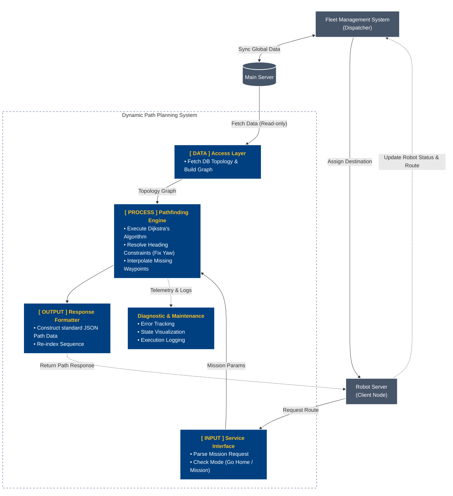

### Dynamic Path Planning System for Robotics Cat

**Software Requirements Specification & Technical Design**

#### 1. Requirements Engineering

**1.1 ที่มาและขอบเขตของปัญหา (Problem Statement & Scope)**
1) ระบบเดิมสั่งการหุ่นยนต์ผ่านชุดไฟล์ภารกิจ JSON Template ที่ระบุลำดับตำแหน่งและค่าคอนฟิกไว้ตายตัวแบบ Static Array (เช่น `final_packing_1month.json`)
2) ระบบเดิมไม่สามารถปรับเปลี่ยนจุดเริ่มต้นหรือสลับลำดับการตรวจจับแบบยืดหยุ่นได้
3) หากผู้ใช้งานเลือกเฉพาะจุดที่ต้องการตรวจสอบ (เช่น จุด 1, 2, 3) ระบบเดิมไม่สามารถหาเส้นทางย่อยและแทรกจุดเชื่อมต่อ (Via Nodes) ระหว่างจุดที่ไม่เชื่อมต่อกันโดยตรงได้โดยอัตโนมัติ
4) การกำหนดทิศทางหัวหุ่นยนต์ (AngleYaw) แบบคงที่ตลอดเวลาทำให้หุ่นยนต์ไม่สามารถหมุนตัวล่วงหน้าตามแนวเส้นทางที่เดินจริงได้อย่างราบรื่น
5) ระบบใหม่ต้องแปลงฐานข้อมูลจุดตรวจทั้งหมดให้อยู่ในรูป Graph Topology และใช้ Dijkstra's Algorithm คำนวณรอยต่อระหว่างจุดเป้าหมาย พร้อมสร้าง JSON Template ส่งกลับให้ตัวควบคุมหุ่นยนต์ทำงานได้อย่างถูกต้อง

**1.2 ข้อกำหนดเชิงฟังก์ชัน (Functional Requirements - FR)**

**1.2.1 Graph Topology Transformation (การแปลงแม่แบบทางเดินเป็นโครงข่ายกราฟ)**
- ระบบต้องสามารถอ่านข้อมูลพิกัด (X, Y, Z) และการเชื่อมต่อ (Edges) จากฐานข้อมูลพิกัดโหนด (Node Database) และฐานข้อมูลเส้นทาง (Edge Topology)
- ระบบจะต้องสร้างโครงสร้างข้อมูลแบบ Directed/Undirected Graph ไว้ในหน่วยความจำ (In-memory Graph) เพื่อรองรับการค้นหา
- หากไม่มีข้อมูลการเชื่อมต่อ ระบบจะต้องสามารถเชื่อมต่อจุดที่อยู่ใกล้เคียงกันแบบลำดับ (Sequential Mesh) จากไฟล์ JSON เพื่อสร้างกราฟจำลองขึ้นมาทดแทนได้อัตโนมัติ

**1.2.2 Multi-Segment Waypoint Interpolation & Stitching (การคำนวณแทรกเส้นทางระหว่างจุดภารกิจ)**
- ระบบต้องรองรับการรับข้อมูล Input เป็น Template เส้นทางที่ประกอบไปด้วยจุดเป้าหมายหลัก (Inspection และ Via nodes) เช่น เส้นทาง `[A, B, C]`
- ระบบต้องใช้ Dijkstra's Algorithm (หรือเทียบเท่า) เพื่อประมวลผลหาจุดเชื่อมต่อ (Intermediate Via Nodes) ที่หายไประหว่างเป้าหมายหลัก
- ตัวอย่าง: หากหุ่นยนต์ต้องการเดินทางจากจุด `A` ไปยัง `B` แต่ไม่มีเส้นทางตรงเชื่อมกัน ระบบจะค้นหาและแทรกจุดเชื่อมต่อที่จำเป็น เช่น `A -> A01 -> A02 -> B` ให้โดยอัตโนมัติ เพื่อให้หุ่นยนต์สามารถทำงานตาม Template ได้อย่างไร้รอยต่อ

**1.2.3 Dynamic Heading Constraint Management**
- ระบบจะต้องสามารถบริหารจัดการมุมหันหน้าของหุ่นยนต์ (AngleYaw หรือ Heading) ตามพารามิเตอร์ควบคุมทิศทาง (Heading Constraint Parameter) ที่ตั้งค่าไว้ที่แต่ละโหนดได้อย่างยืดหยุ่น โดยแบ่งระดับความสำคัญเป็น 3 ระดับ:
  - **Level 0 (Fully Locked):** ล็อคทิศทางแบบตายตัว หุ่นยนต์ต้องหันหน้าตามค่าเดิมที่ถูกตั้งไว้ในระบบเสมอ (ไม่ว่าจะเป็นภารกิจใดก็ตาม)
  - **Level 1 (Conditionally Locked):** ทิศทางจะถูกล็อคตามค่าเดิมเมื่อเป็นการทำงานปกติ (เช่น จุดตรวจสอบ) แต่ถ้าระบบอยู่ในโหมด "กลับฐาน (Return to Base / Go Home)" การล็อคนี้จะถูกยกเลิกเพื่อให้หุ่นยนต์เดินหน้าผ่านไปได้อย่างรวดเร็ว
  - **Level 2 (Freely Editable):** จุดเชื่อมต่อที่ไม่มีความสำคัญด้านทิศทาง ระบบจะคำนวณมุม AngleYaw ใหม่โดยอัตโนมัติ ให้หุ่นยนต์หันหน้าไปทางจุดหมายถัดไปเสมอ เพื่อการเคลื่อนที่ราบรื่นที่สุด

**1.2.4 Locomotion & Mode Integrity Preservation (การคงสภาพพารามิเตอร์การขับเคลื่อน)**
- เมื่อมีการแทรกจุดใหม่ หรือจัดลำดับเส้นทางใหม่ ระบบจะต้องรักษาสภาพของพารามิเตอร์ที่ควบคุมพฤติกรรม (Locomotion) ของแต่ละโหนดไว้อย่างถูกต้อง เช่น รูปแบบการก้าวเดิน (Gait), ความเร็ว (Speed), โหมดนำทาง (Navigation Mode), ท่าทาง (Posture) และโหมดหลบหลีกสิ่งกีดขวาง (Obstacle Avoidance Mode)
- การคัดลอกหรือสร้างโหนดใหม่จะต้องดึงค่ามาตรฐานจากฐานข้อมูลหลักมาใส่ลงใน Template อย่างแม่นยำ

**1.2.5 JSON Schema Compatibility & Sequence Re-indexing (การส่งออกและจัดลำดับดัชนีใหม่)**
- โครงสร้างข้อมูลที่คำนวณเสร็จสิ้นแล้ว จะต้องถูกแปลงกลับให้อยู่ในรูปแบบโครงสร้าง JSON Schema เดิมของหุ่นยนต์
- ระบบจะต้องทำการ Re-index หมายเลขลำดับของจุดอ้างอิงและ Task ย่อยทั้งหมดใหม่ เพื่อไม่ให้เกิดข้อขัดแย้ง (Conflict)
- รองรับการ Export ไฟล์ผลลัพธ์ให้อยู่ในโครงสร้างมาตรฐาน เพื่อให้พร้อมสำหรับการ Deploy ไปยังระบบควบคุมหุ่นยนต์ทันที

**1.3 ข้อกำหนดที่ไม่ใช่เชิงฟังก์ชัน (Non-Functional Requirements - NFR)**

**1.3.1 Reliability & Safety - Graph Disconnection Handling**
- หากจุดเริ่มต้นและเป้าหมายอยู่บนพื้นที่ที่ไม่สามารถเชื่อมต่อถึงกันได้ (Graph Disconnected) ระบบจะต้องไม่เกิดการทำงานขัดข้อง (Crash) แต่ต้องแสดงผลแจ้งเตือน Error ให้ผู้ใช้ทราบอย่างชัดเจน
- ระบบต้องมีกลไกป้องกันการวนลูปไม่รู้จบ (Infinite Loop Prevention) ในกรณีที่ข้อมูลความสัมพันธ์ของโหนด (Edge Topology) เกิดความผิดปกติหรือมีการอ้างอิงกลับไปมาแบบวงกลม (Circular Reference)

**1.3.2 Computational Latency & Performance**
- การคำนวณค้นหาเส้นทางแบบกราฟจะต้องทำงานเสร็จสิ้นด้วยความรวดเร็ว (ต่ำกว่า 500 ms) เพื่อไม่ให้กระทบต่อประสบการณ์ใช้งาน (User Experience) ของส่วนแสดงผล (UI Layer)
- โครงสร้างอัลกอริทึมต้องได้รับการปรับแต่งให้ใช้หน่วยความจำ (Memory Footprint) อย่างมีประสิทธิภาพ รองรับการประมวลผลกราฟที่มีความซับซ้อนและมีจำนวนโหนดมากกว่า 1,000 จุดได้อย่างราบรื่น

**1.3.3 Data Precision & Zero Data Corruption**
- การคำนวณและแปลงพิกัด (X, Y, Z) ตลอดจนองศาการหมุน (Radian) จะต้องใช้ทศนิยมความละเอียดสูง ป้องกันความคลาดเคลื่อนสะสม (Floating-point Error) ระหว่างกระบวนการคำนวณ
- การส่งออกข้อมูลผลลัพธ์จะต้องคงโครงสร้างและชนิดของข้อมูล (Data Type) เดิมไว้อย่างครบถ้วน ห้ามมีการสูญหายหรือการปัดเศษค่าตัวเลขที่อาจส่งผลต่อความแม่นยำในการเดินของหุ่นยนต์

**1.3.4 Fail-Safe & Slope Constraint Validation**
- ระบบต้องมีความสามารถที่จะป้องกันการสร้างเส้นทางที่ฝืนข้อจำกัดทางฟิสิกส์ของหุ่นยนต์ (เช่น เส้นทางที่ไม่ได้อยู่ในโครงข่าย) โดยยึดถือข้อมูลที่ถูกรับรองแล้วในฐานข้อมูลเป็นหลัก
- ในกรณีที่ระบบตรวจพบเส้นทางที่มีความเสี่ยงสูง (เช่น การเชื่อมต่อที่ถูกระบุว่าอันตราย) ระบบจะต้องระงับการสร้างเส้นทางนั้นและส่งคืนค่าความผิดพลาด (Failure Code) ทันทีเพื่อความปลอดภัย

**1.3.5 Modularity & Extensibility (ความยืดหยุ่นและรองรับการขยายตัว)**
- **Decoupled Architecture:** โครงสร้างของระบบประมวลผลเส้นทาง (Path Planning Engine) ต้องถูกออกแบบให้เป็นอิสระจากส่วนแสดงผล (GUI Layer) อย่างสิ้นเชิง เพื่อรองรับการทำงานแบบ Headless Mode หรือนำไปเชื่อมต่อกับระบบอื่นผ่าน API ในอนาคต
- **Algorithm Interchangeability:** โครงสร้างของระบบ (Interface) ต้องรองรับการสับเปลี่ยนอัลกอริทึมค้นหาเส้นทาง (เช่น จาก Dijkstra เป็น A* หรือ D*) ได้โดยไม่ต้องปรับแก้ Logic หลักในส่วนการทำงานอื่นๆ ของโปรแกรม

#### 2. System Architecture & Technical Design

**2.1 สถาปัตยกรรมเชิงตรรกะและองค์ประกอบของระบบ (Logical Architecture & Components)**

การออกแบบสถาปัตยกรรมซอฟต์แวร์ถูกออกแบบโดยแยกระบบออกเป็น 3 เลเยอร์อิสระ (Separation of Concerns) เพื่อให้ระบบสามารถทดสอบ (Testable) และดูแลรักษาได้ง่าย (Maintainable):

1. **Data Access & State Management Layer:** 
   - ทำหน้าที่จัดการ Data Persistence และ I/O Operations 
   - โหลดข้อมูลจาก Flat-file Database และแปลงเป็นโครงสร้าง In-memory Arrays
   - ควบคุม UI State ของ Sidebar (Pagination, Filtering, Selection Highlights) เพื่อส่งต่อให้ Presentation Layer

2. **Pathfinding Engine ([PROCESS] Layer):**
   - เป็นหัวใจหลักของระบบ (Business Logic) ออกแบบให้อยู่ในรูปของ Module ที่ไม่มีการผูกติดกับ GUI (Decoupled)
   - **Execute Dijkstra's Algorithm:** ใช้อัลกอริทึมค้นหาเส้นทางที่สั้นและเหมาะสมที่สุด ระหว่างจุดเริ่มต้นและเป้าหมาย ผ่านโครงสร้างข้อมูล (Priority Queue) ในการทำ Node Relaxation
   - **Resolve Heading Constraints (Fix Yaw):** ตรวจสอบเงื่อนไขการทำงานและปรับแก้ทิศทางการหันหน้า (Yaw) ของหุ่นยนต์ให้ถูกต้องตามคุณลักษณะของโหนดเป้าหมาย (Node Properties) และสถานะภารกิจ
   - **Interpolate Missing Waypoints:** คำนวณและแทรกพิกัดจุดเชื่อมต่อย่อยระหว่างเส้นทาง (Interpolation) เพื่ออุดช่องโหว่ของข้อมูล และช่วยให้หุ่นยนต์สามารถเคลื่อนที่ได้อย่างราบรื่นและต่อเนื่อง

3. **Service Communication Interface (API/Service Node):**
   - ในท้ายที่สุด (Ultimate Goal) โมดูลนี้จะทำหน้าที่เป็น Service Server ภายในระบบเครือข่ายของหุ่นยนต์ (เช่น ROS Node)
   - รอรับคำสั่ง (Call Service) จาก Client ที่ต้องการเส้นทาง และส่งพารามิเตอร์เป้าหมายไปให้ Core Engine ประมวลผล
   - ส่งคืนผลลัพธ์เส้นทาง (Return Path) กลับไปยัง Client ในรูปแบบมาตรฐาน (ส่วน GUI หรือ Visualization Canvas ที่มีอยู่ในปัจจุบันเป็นเพียงเครื่องมือเสริมสำหรับการจำลองและทดสอบการทำงานของอัลกอริทึมในฝั่งผู้พัฒนาเท่านั้น)

**2.2 แบบจำลองทางคณิตศาสตร์และอัลกอริทึม (Mathematical Models & Algorithms)**

**2.2.1 Topological Graph & Edge Cost (Weight Formulation)**
ก่อนการค้นหาเส้นทาง ระบบจะสร้างโครงข่าย $G = (V, E)$ โดยที่ $V$ คือเซ็ตของโหนดทั้งหมด และ $E$ คือเส้นทางเชื่อมต่อ
- การคำนวณน้ำหนัก (Cost) หรือระยะทางระหว่างโหนด $A(x_1, y_1, z_1)$ และโหนด $B(x_2, y_2, z_2)$ จะใช้สมการ Euclidean Distance 3 มิติ เพื่อสะท้อนระยะทางเชิงกายภาพที่แท้จริง:
  $$W_{A,B} = \sqrt{(X_B - X_A)^2 + (Y_B - Y_A)^2 + (Z_B - Z_A)^2}$$

**2. Dijkstra's Algorithm Optimization**
การค้นหาใช้โครงสร้าง `Priority Queue` เพื่อให้มี Time Complexity อยู่ที่ $O((|V| + |E|) \log |V|)$
- **Initialization:** $d(v) = \infty$ สำหรับทุก $v \in V$, $d(\text{start}) = 0$
- **Relaxation:** หาก $d(u) + W_{u,v} < d(v)$ ระบบจะทำการอัปเดตค่า $d(v)$ และบันทึก $u$ เป็น `previous_node` ของ $v$

**3. Kinematic Heading Resolution (Dynamic Yaw Calculation)**
เมื่อได้เส้นทางที่สั้นที่สุด ระบบจะต้องคำนวณมุมหันหน้าของหุ่นยนต์ (Heading) ของแต่ละจุด โดยมี Constraint Function ดังนี้:
ให้ $Yaw_{orig}$ คือมุมดั้งเดิมในฐานข้อมูล, $\theta$ คือมุมที่คำนวณใหม่
$$\theta = \text{atan2}(Y_{next} - Y_{current}, X_{next} - X_{current})$$
ระบบจะประเมินจากข้อกำหนดการหันหน้า (Heading Policy / $FY$):
- ถ้า $FY = 0$ (Fully Locked): มุมสุดท้ายคือ $Yaw_{orig}$
- ถ้า $FY = 1$ (Conditionally Locked):
  - ถ้าภารกิจคือโหมด "กลับฐาน (Return to Base)": มุมสุดท้ายคือ $\theta$
  - ถ้าไม่ใช่: มุมสุดท้ายคือ $Yaw_{orig}$
- ถ้า $FY = 2$ (Freely Editable): มุมสุดท้ายคือ $\theta$ (หันหน้าเข้าหาจุดหมายเสมอ)